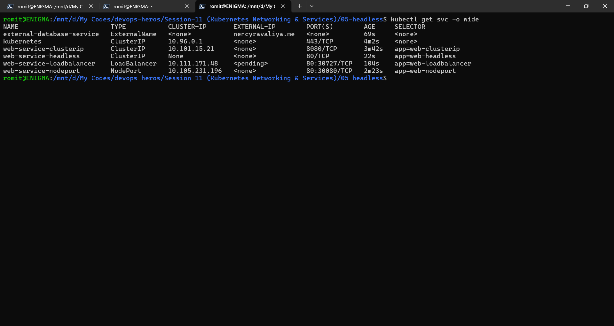
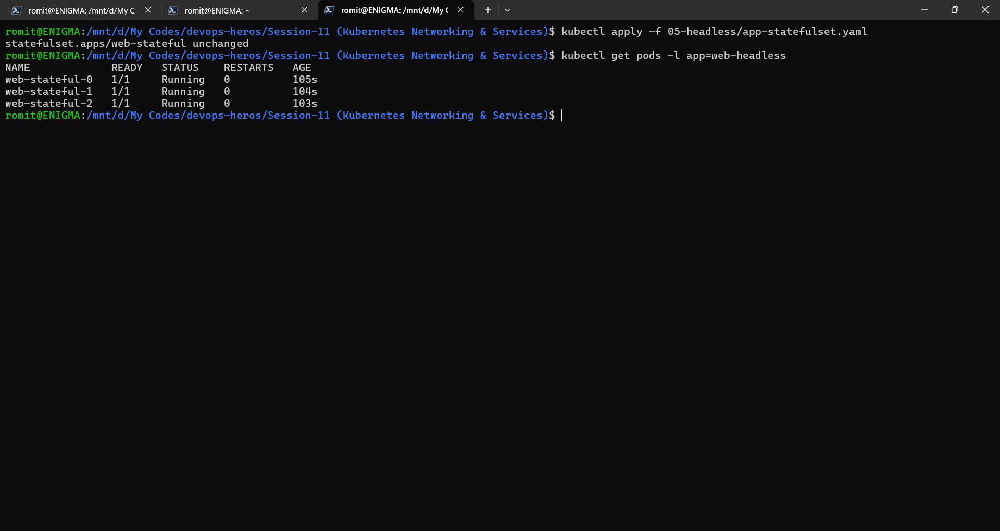
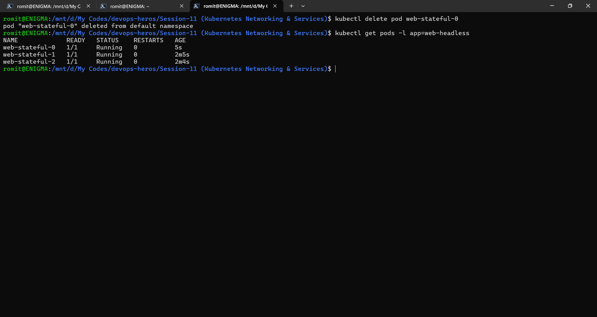
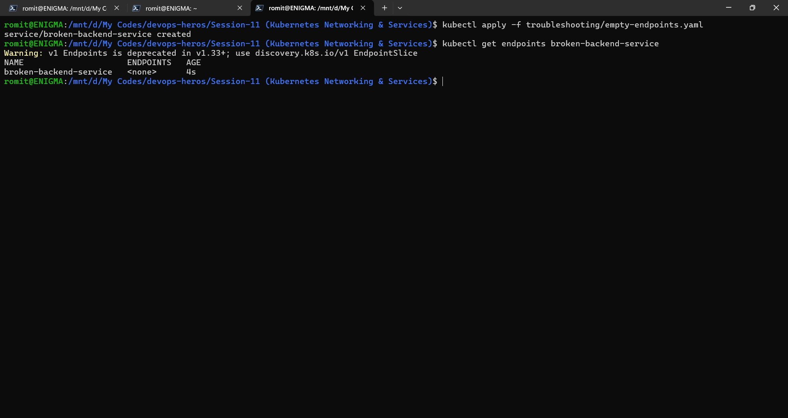
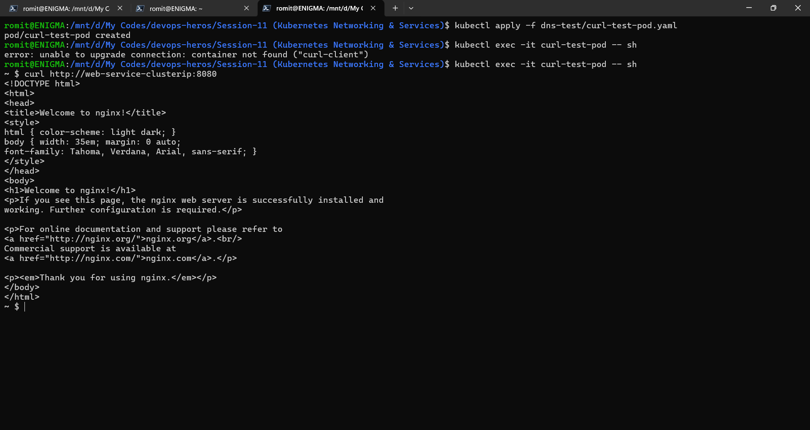
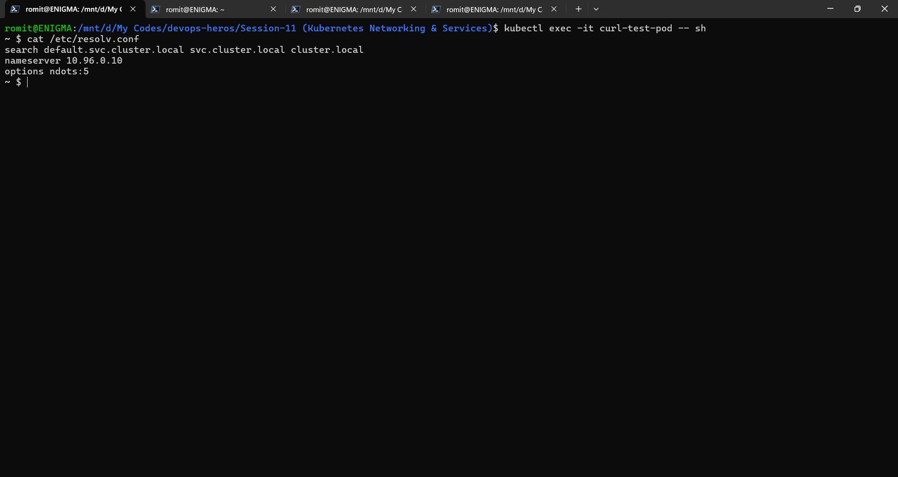

# Kubernetes Networking & Services Homework

## Task 1: All 5 Service Types

Deployed all 5 service types, ClusterIP, NodePort, LoadBalancer, ExternalName, and Headless, each with its own deployment and service yaml. Verified all of them together with a single combined command.

```bash
kubectl get svc -o wide
```

This single output shows all 5 types side by side with their distinct CLUSTER-IP and TYPE columns.



## Task 2: StatefulSet Naming Behavior

Deployed a StatefulSet paired with the headless service, then deleted one specific pod to confirm the replacement kept the exact same name instead of getting a new randomly suffixed one.

```bash
kubectl apply -f 05-headless/app-statefulset.yaml
kubectl get pods -l app=web-headless
```



```bash
kubectl delete pod web-stateful-0
kubectl get pods -l app=web-headless
```

Confirmed the replacement pod was also named web-stateful-0, unlike a Deployment where a recreated pod gets a brand new random suffix.



## Task 3: Selector Mismatch on a Service

```bash
kubectl apply -f troubleshooting/empty-endpoints.yaml
kubectl get endpoints broken-backend-service
```

Endpoints came back as none, confirming the service's selector does not match any running pod's labels, the standard diagnostic signal for this kind of failure.



## Task 4: FQDN and CoreDNS Hands On

```bash
kubectl apply -f dns-test/curl-test-pod.yaml
kubectl exec -it curl-test-pod -- sh
curl http://web-service-clusterip:8080
```

Short name resolution worked correctly within the same namespace.



```bash
curl http://web-service-clusterip.default
curl http://web-service-clusterip.default.svc.cluster.local
```

Both the namespace-qualified form and the full FQDN form did not resolve. Since the short name alone worked fine, this points to something specific to how the longer forms were queried in this environment rather than DNS being broken outright, most likely the test pod was not actually running in the default namespace, or the CoreDNS search path for this cluster was not appending the domain the way it does for a standard namespace.svc.cluster.local lookup. Worth retrying with kubectl get pod curl-test-pod -o wide to confirm the actual namespace and cat /etc/resolv.conf inside the pod to check the real search list before assuming CoreDNS itself is misconfigured.



## Task 5: Written Answers

**What is FQDN**

FQDN stands for Fully Qualified Domain Name. Inside Kubernetes it follows the pattern service-name.namespace.svc.cluster.local. The service name identifies the specific service, the namespace disambiguates it from an identically named service running in a different namespace, svc marks it as a service record rather than a pod record, and cluster.local is the cluster's own root DNS domain.

**What is CoreDNS**

CoreDNS is the DNS server that runs automatically inside every Kubernetes cluster, in the kube-system namespace. It continuously watches the API server, and whenever a service is created, updated, or deleted, it updates its own internal DNS records to match, so service names always resolve to whatever is currently live.

**How Kubernetes DNS resolves automatically**

Every pod gets a resolv.conf file automatically injected into it that includes a search list of domain suffixes to try. For a pod running in a given namespace, that search list includes namespace.svc.cluster.local, which is why a short name like a bare service name resolves correctly without needing to spell out the full FQDN, as long as the pod doing the lookup is in the same namespace as the service. Reaching across namespaces needs at least service.namespace, or the full FQDN for zero ambiguity, since the automatic search suffix only covers the pod's own namespace by default.