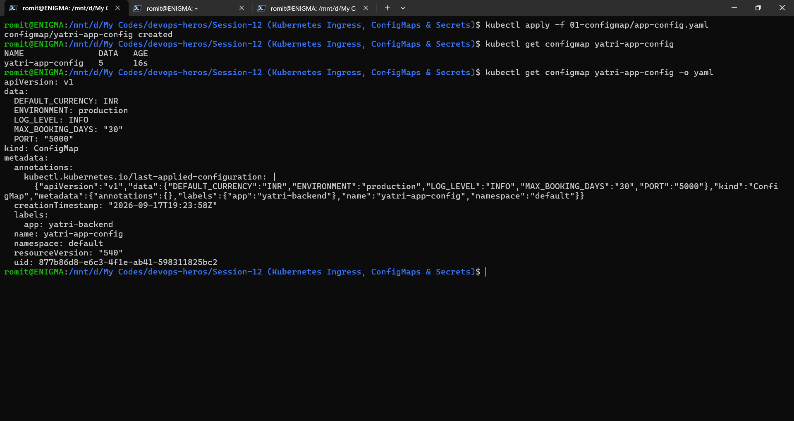
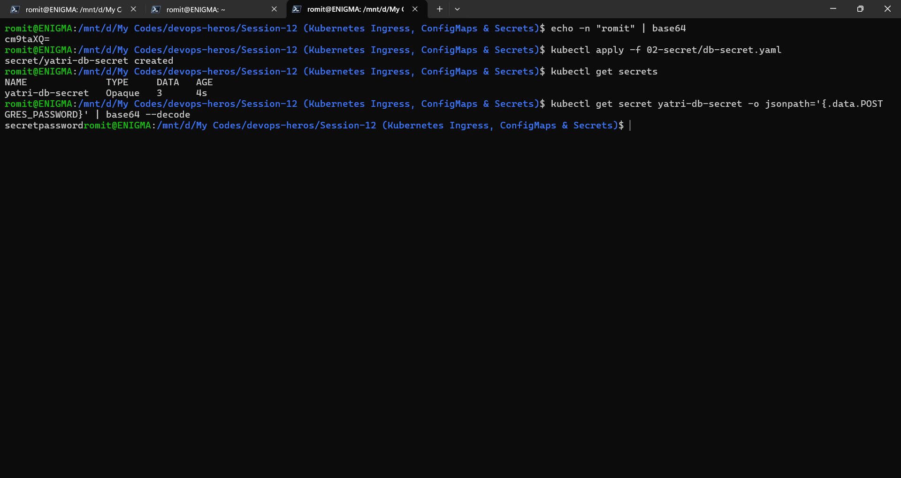
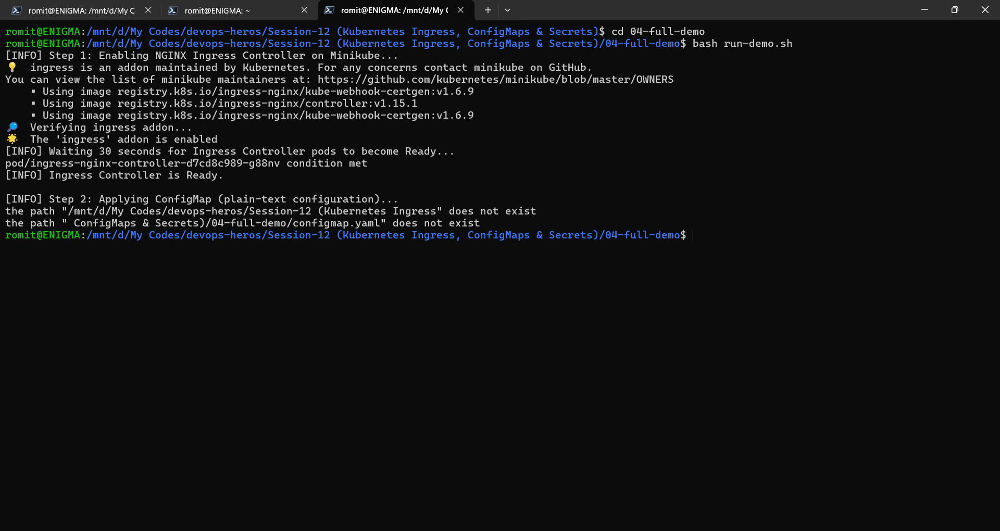
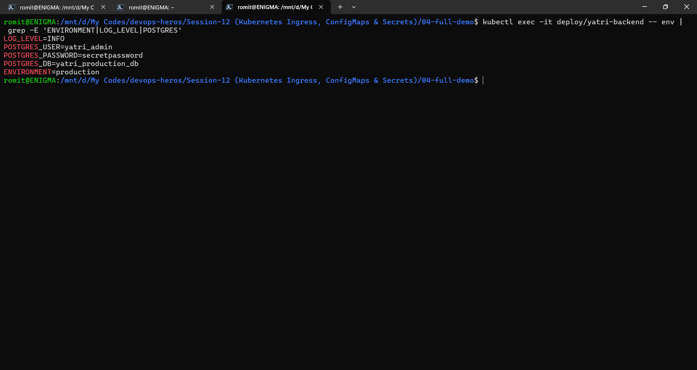

# Kubernetes Ingress, ConfigMaps & Secrets Homework

## Task 1: ConfigMap, Deploy and Verify

```bash
kubectl apply -f 01-configmap/app-config.yaml
kubectl get configmap yatri-app-config
kubectl get configmap yatri-app-config -o yaml
```

Confirmed all 5 keys, ENVIRONMENT, LOG_LEVEL, PORT, DEFAULT_CURRENCY, and MAX_BOOKING_DAYS, present in the stored ConfigMap.



## Task 2: Secret, Encode Correctly, Deploy, Decode

```bash
echo -n "yourusername" | base64
kubectl apply -f 02-secret/db-secret.yaml
kubectl get secrets
kubectl get secret yatri-db-secret -o jsonpath='{.data.POSTGRES_PASSWORD}' | base64 --decode
```

Used echo -n specifically to avoid a trailing newline being encoded into the value, then confirmed the decoded password matched the original plaintext exactly.



## Task 3: Full Demo, ConfigMap, Secret, and Ingress End to End

```bash
cd 04-full-demo
bash run-demo.sh
```

This enabled the Minikube ingress addon, applied the ConfigMap, Secret, frontend, backend, and ingress rules, and added yatri.local to /etc/hosts automatically.

Verified the frontend and backend routes came up correctly through the ingress.





## Task 4: Written Answers

**Ingress vs Ingress Controller**

An Ingress is just a set of routing rules written as YAML, it does nothing on its own. It declares things like which host or path should route to which backend service, the same way a Deployment YAML declares desired pod state without actually running anything by itself. An Ingress Controller is the actual running software, a real pod acting as a Layer 7 HTTP reverse proxy, that reads Ingress resources and implements the routing they describe. Without an Ingress Controller installed in the cluster, an Ingress resource changes nothing at all. On Minikube this controller has to be explicitly enabled with minikube addons enable ingress before any Ingress YAML has any effect. The most common controller is NGINX, HAProxy is another widely used alternative.

**Ways to Store Secrets in Real Practice**

Manual base64 encoding, which is what this homework used, is the simplest option but has a real limit, base64 is encoding, not encryption, so anyone who knows a value is base64 encoded can trivially decode it back to plaintext. It mainly just prevents a raw password from sitting as obviously readable plain text in a file. Real organizations typically go further using dedicated secret vaults like HashiCorp Vault, AWS Secrets Manager, or Azure Key Vault, which handle the actual encryption themselves, log every access and modification tied to a specific user's identity for auditing, and support automatic credential rotation on a schedule. A more commonly used alternative in practice, mainly for cost reasons since the vault services above are billed, is Azure DevOps variable libraries, where the actual secret value is never written into any file at all and is instead resolved at pipeline run time from a variable group configured directly in the Azure DevOps portal.

**Why a Database Needs StatefulSet, Not Deployment**

A database needs persistent, stable identity, not just a running container. A Deployment's pods are fully interchangeable and get a new randomly suffixed name every time they are recreated, which works fine for stateless apps but breaks a database, since a database's data and identity need to survive pod recreation in a way that is still addressable afterward. A StatefulSet solves this by giving each pod a stable, predictable name that persists across recreation, paired with a headless service so each replica also gets its own individually addressable DNS name, which is exactly what a distributed, stateful system needs to keep track of which specific replica holds which data.