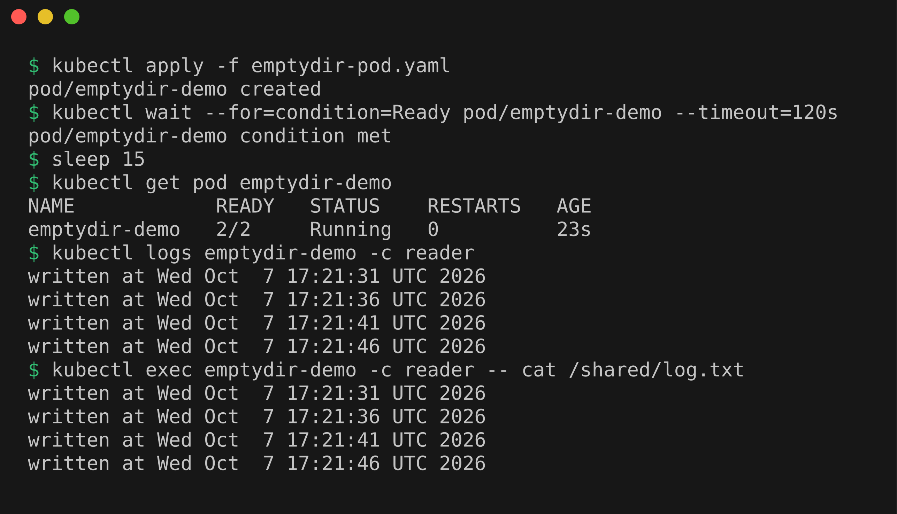
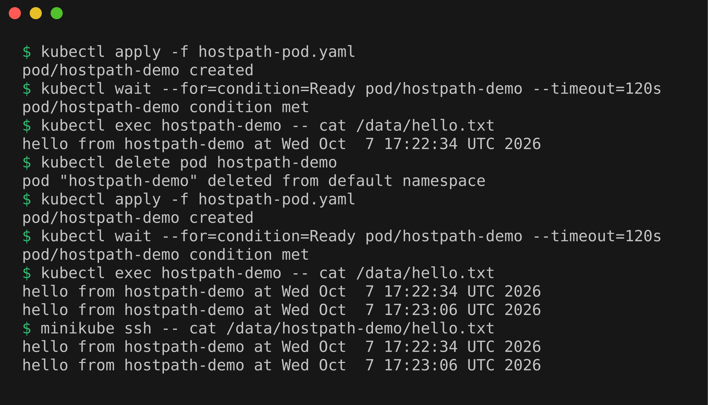
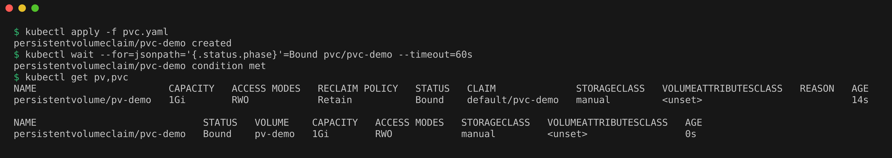
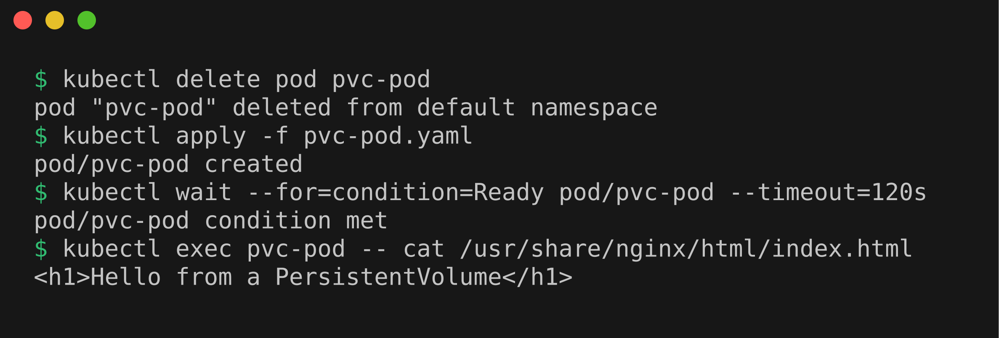
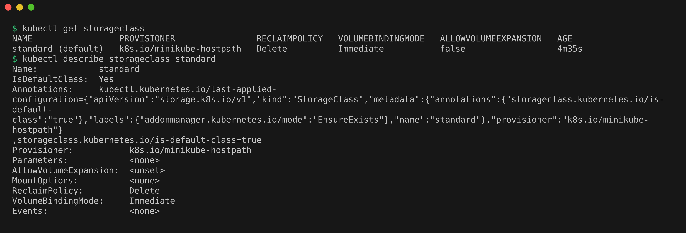
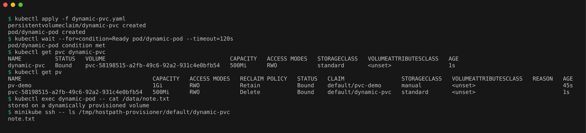

# Kubernetes Volumes

A container's filesystem is temporary. When the container restarts, anything it wrote is gone, because Kubernetes starts a fresh copy from the image. A **volume** is a directory that Kubernetes mounts into the container (attaches at a path like `/data`) so data can outlive a restart or be shared between containers.

In this part I tried the main storage options one by one on my Minikube cluster (docker driver, inside WSL2 Ubuntu). Every example has its own YAML file in this folder.

One thing to know about Minikube with the docker driver: the Kubernetes "node" is itself a Docker container called `minikube`. So when a volume says "on the node", it means inside that container, not in my WSL home folder. I can look inside it with `minikube ssh`.

## emptyDir

An **emptyDir** is an empty folder that Kubernetes creates when the Pod starts on a node. All containers in the Pod can mount it, so it is a simple way for them to share files. It survives a container crash, but it is deleted for good when the Pod is removed from the node.

File: `emptydir-pod.yaml`. The `writer` container appends a line with the date to `/shared/log.txt` every 5 seconds, and the `reader` container prints that same file with `tail -f`.

```bash
kubectl apply -f emptydir-pod.yaml
kubectl wait --for=condition=Ready pod/emptydir-demo --timeout=120s
sleep 15
kubectl get pod emptydir-demo          # READY should be 2/2
kubectl logs emptydir-demo -c reader   # lines written by the other container
kubectl exec emptydir-demo -c reader -- cat /shared/log.txt
```

The pod came up `2/2 Running`, and the reader's logs showed four lines like `written at Wed Oct  7 17:21:31 UTC 2026`, even though the reader never writes anything. That proves both containers see the same folder.



Now delete the Pod and create it again:

```bash
kubectl delete pod emptydir-demo
kubectl apply -f emptydir-pod.yaml
kubectl wait --for=condition=Ready pod/emptydir-demo --timeout=120s
kubectl exec emptydir-demo -c reader -- cat /shared/log.txt
```

(Deleting this busybox Pod took about 30 seconds, because the shell ignores the stop signal and Kubernetes waits for the grace period before killing it.)

The file had only one fresh line. The old lines were gone, because the emptyDir was deleted together with the old Pod. Good for caches and scratch space, not for anything you want to keep.

## hostPath

A **hostPath** volume mounts a file or folder from the node's own filesystem into the Pod. The data stays on the node after the Pod is deleted. `type: DirectoryOrCreate` tells Kubernetes to create the folder if it does not exist yet.

File: `hostpath-pod.yaml`. It mounts `/data/hostpath-demo` from the node at `/data` and appends one line to `hello.txt` every time the Pod starts.

```bash
kubectl apply -f hostpath-pod.yaml
kubectl wait --for=condition=Ready pod/hostpath-demo --timeout=120s
kubectl exec hostpath-demo -- cat /data/hello.txt
kubectl delete pod hostpath-demo
kubectl apply -f hostpath-pod.yaml
kubectl wait --for=condition=Ready pod/hostpath-demo --timeout=120s
kubectl exec hostpath-demo -- cat /data/hello.txt
minikube ssh -- cat /data/hostpath-demo/hello.txt
```

After the second apply, the file had two lines (one from each Pod), so the data survived the Pod deletion. The `minikube ssh` command showed the same two lines directly on the node. I used `/data` because the Minikube docs list it as one of the folders that Minikube keeps across restarts.



Caveats (from the Kubernetes docs): hostPath is a security risk because a Pod can read or change files on the node. The data is also tied to one node, so on a cluster with several nodes a rescheduled Pod could land on a different node and find an empty folder. It is fine for learning on a single node Minikube, but avoid it for real apps.

## PersistentVolume (PV)

A **PersistentVolume** is a piece of storage that exists in the cluster on its own, separate from any Pod. Think of it as a disk that an admin has registered with Kubernetes. It has a size, **access modes** (who can mount it, for example `ReadWriteOnce` means read-write by a single node) and a **reclaim policy** (what happens to it when nobody needs it anymore: `Retain` keeps the data, `Delete` removes it).

File: `pv.yaml`. It is 1Gi, backed by the node folder `/data/pv-demo`, with `storageClassName: manual` and `Retain`.

```bash
kubectl apply -f pv.yaml
kubectl get pv
kubectl describe pv pv-demo
```

Output (some columns trimmed):

```
NAME      CAPACITY   ACCESS MODES   RECLAIM POLICY   STATUS      CLAIM   STORAGECLASS
pv-demo   1Gi        RWO            Retain           Available           manual
```

`Available` means the PV exists but nobody has claimed it yet.

## PersistentVolumeClaim (PVC)

A **PersistentVolumeClaim** is a request for storage made by the user of the app: "I need 1Gi, ReadWriteOnce, of class manual". Kubernetes looks for a PV that matches and **binds** them (links them one to one). The Pod then only mentions the claim name and never needs to know where the storage really lives.

Files: `pvc.yaml` (the claim) and `pvc-pod.yaml` (nginx that mounts the claim at `/usr/share/nginx/html`, the folder nginx serves web pages from).

```bash
kubectl apply -f pvc.yaml
kubectl wait --for=jsonpath='{.status.phase}'=Bound pvc/pvc-demo --timeout=60s
kubectl get pv,pvc
```

Both showed `STATUS Bound`, and the PV's `CLAIM` column now says `default/pvc-demo`.



Now start nginx, write a page into the volume, and check it:

```bash
kubectl apply -f pvc-pod.yaml
kubectl wait --for=condition=Ready pod/pvc-pod --timeout=180s
kubectl exec pvc-pod -- sh -c 'echo "<h1>Hello from a PersistentVolume</h1>" > /usr/share/nginx/html/index.html'
kubectl port-forward pod/pvc-pod 8080:80     # leave running, use a second terminal
curl http://localhost:8080
```

The curl returned `<h1>Hello from a PersistentVolume</h1>`. Then I stopped the port-forward and deleted and recreated the Pod:

```bash
kubectl delete pod pvc-pod
kubectl apply -f pvc-pod.yaml
kubectl wait --for=condition=Ready pod/pvc-pod --timeout=120s
kubectl exec pvc-pod -- cat /usr/share/nginx/html/index.html
```

The same `<h1>` line was still there. The Pod is brand new, but the data lives in the PV, so it persists.



## StorageClass

Creating a PV by hand for every app gets boring fast. A **StorageClass** describes a "type" of storage and names a **provisioner**, which is a program that can create PVs automatically. Minikube ships with one StorageClass called `standard`, marked as the default, using the provisioner `k8s.io/minikube-hostpath`.

No YAML file is needed here, it already exists in the cluster:

```bash
kubectl get storageclass
kubectl describe storageclass standard
```

Output (AGE column trimmed):

```
NAME                 PROVISIONER                RECLAIMPOLICY   VOLUMEBINDINGMODE   ALLOWVOLUMEEXPANSION
standard (default)   k8s.io/minikube-hostpath   Delete          Immediate           false
```



Note that the `manual` class I used above does not exist as a StorageClass object. That is fine: for static binding Kubernetes only matches the class name on the PV and the PVC.

## Dynamic provisioning

**Dynamic provisioning** means I only write the PVC, and the StorageClass's provisioner creates a matching PV for me on the spot. This is how storage normally works on cloud clusters (for example, a PVC on EKS creates an EBS disk).

File: `dynamic-pvc.yaml`. It has a 500Mi PVC with `storageClassName: standard` and a busybox Pod that writes `note.txt` into it.

```bash
kubectl apply -f dynamic-pvc.yaml
kubectl wait --for=condition=Ready pod/dynamic-pod --timeout=120s
kubectl get pvc dynamic-pvc
kubectl get pv
kubectl exec dynamic-pod -- cat /data/note.txt
minikube ssh -- ls /tmp/hostpath-provisioner/default/dynamic-pvc
```

The PVC was `Bound` to a PV with a generated name, `pvc-58198515-a2fb-49c6-92a2-931c4e0bfb54`. That PV has reclaim policy `Delete`, class `standard`, and I never wrote it. The Minikube provisioner stores the data on the node under `/tmp/hostpath-provisioner/<namespace>/<pvc-name>`, and `ls` there showed `note.txt`.



If the PVC stays `Pending`, check that the `storage-provisioner` and `default-storageclass` addons are enabled with `minikube addons list`.

Because the reclaim policy is `Delete`, deleting the PVC also deletes its PV and the data. With my static `pv-demo` (`Retain`), deleting the PVC only moves the PV to `Released` and the files stay in `/data/pv-demo`.

## Quick comparison

| Type | Who creates it | Data survives Pod deletion? | Typical use |
|------|----------------|-----------------------------|-------------|
| emptyDir | Kubernetes, per Pod | No | Sharing files between containers, cache |
| hostPath | You, on the node | Yes, but only on that node | Node level tools, local testing |
| PV + PVC | Admin creates PV, user claims it | Yes | Databases, uploads (static) |
| StorageClass + PVC | Provisioner creates PV | Yes | Normal way on real clusters |

## Cleanup

```bash
kubectl delete -f .
minikube ssh -- sudo rm -rf /data/hostpath-demo /data/pv-demo
```

The first command removes every Pod, PVC and PV from this folder. The second deletes the leftover files on the node, since hostPath and `Retain` volumes keep their data.
