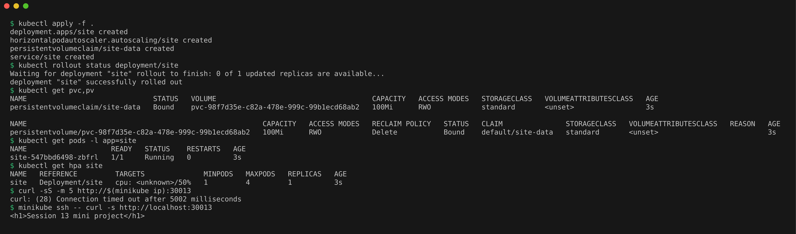
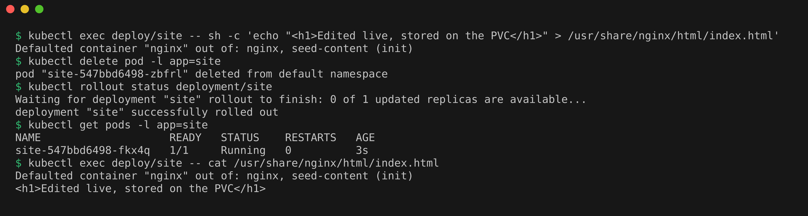
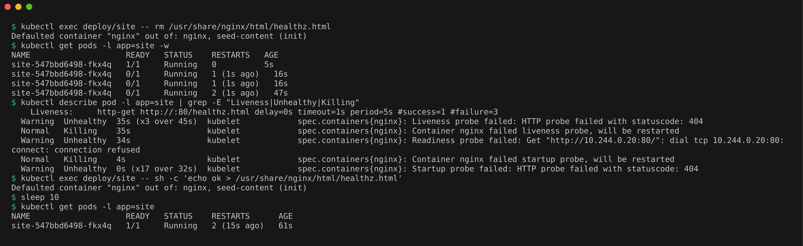
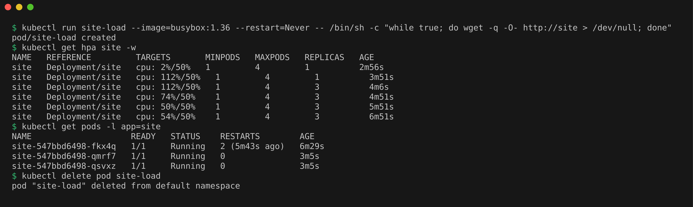

# Mini Project: Self-Healing Website with Persistent Storage

An nginx site whose files live on a PVC, with three probes and an HPA (1 to 4 pods at 50% CPU). An init container writes `index.html` and `healthz.html` only if they are missing.

## The three probes

Startup waits for `/healthz.html` before the other probes begin. Readiness on `/` takes the pod out of the Service when it fails. Liveness on `/healthz.html` restarts the container after 3 failures.

## Deploy

```bash
kubectl apply -f .
kubectl rollout status deployment/site
kubectl get pvc,pv
kubectl get pods -l app=site
kubectl get hpa site
curl -sS -m 5 http://$(minikube ip):30013
minikube ssh -- curl -s http://localhost:30013
```

PVC bound, pod running, and the page answered on the NodePort from inside the node (the node IP is not reachable from WSL).



## Prove the data persists

```bash
kubectl exec deploy/site -- sh -c 'echo "<h1>Edited live, stored on the PVC</h1>" > /usr/share/nginx/html/index.html'
kubectl delete pod -l app=site
kubectl rollout status deployment/site
kubectl get pods -l app=site
kubectl exec deploy/site -- cat /usr/share/nginx/html/index.html
```

The replacement pod still had the edited page.



## Prove liveness self-healing

A restart alone could not fix this, because the missing file was on the persistent volume.

```bash
kubectl exec deploy/site -- rm /usr/share/nginx/html/healthz.html
kubectl get pods -l app=site -w
kubectl describe pod -l app=site | grep -E "Liveness|Unhealthy|Killing"
kubectl exec deploy/site -- sh -c 'echo ok > /usr/share/nginx/html/healthz.html'
sleep 10
kubectl get pods -l app=site
```

Removing the health file caused 2 restarts, and recreating it by hand brought the pod back to `1/1`.



## Scaling

```bash
kubectl run site-load --image=busybox:1.36 --restart=Never -- /bin/sh -c "while true; do wget -q -O- http://site > /dev/null; done"
kubectl get hpa site -w
kubectl get pods -l app=site
kubectl delete pod site-load
```

Load pushed CPU to 112% and HPA scaled from 1 to 3 pods, where it settled near 50%.


