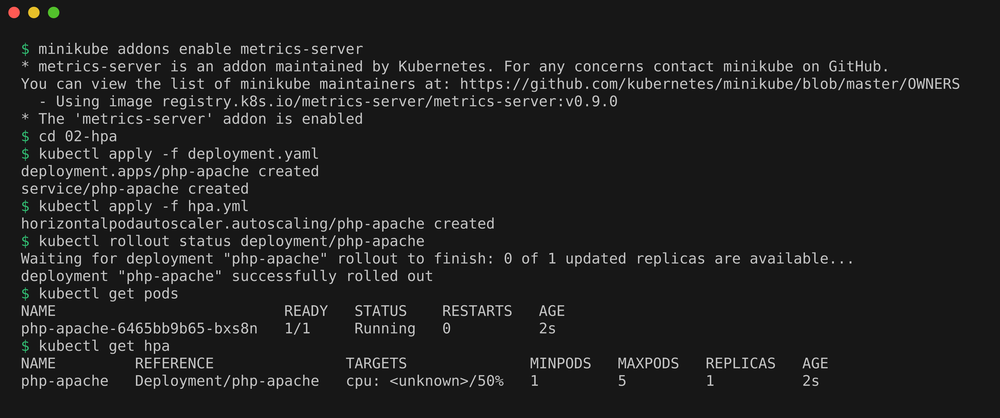
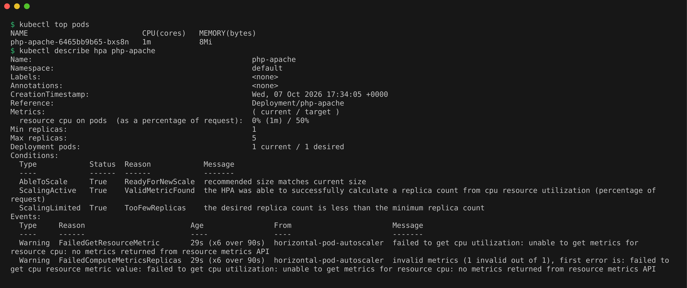
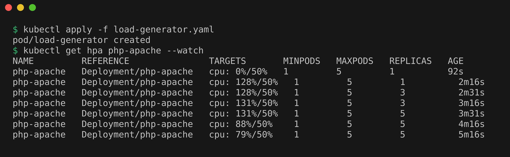
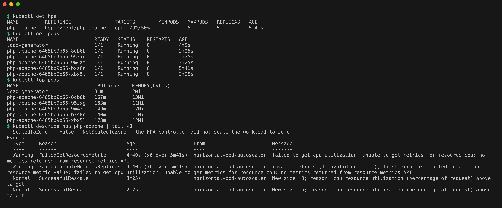
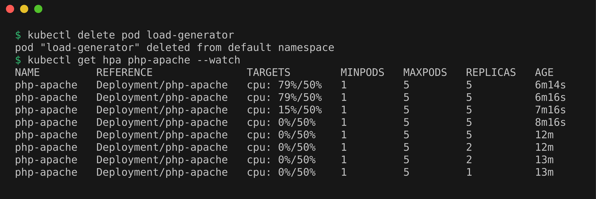

# Kubernetes Storage, HPA & Probes Homework

## Task 1: Kubernetes Volumes

Documented and tried out emptyDir, hostPath, PersistentVolume, PersistentVolumeClaim, StorageClass, and dynamic provisioning, each with its own manifest. The full notes, commands and screenshots are in [01-kubernetes-volumes/README.md](01-kubernetes-volumes/README.md).

The one line summary: emptyDir lives and dies with the pod, hostPath ties data to one node, and PV plus PVC separate "storage that exists" from "a pod asking for storage", with a StorageClass creating PVs automatically on demand.

## Task 2: HPA Hands-on

HPA (Horizontal Pod Autoscaler) watches a metric like CPU and changes the replica count of a Deployment to keep that metric near a target. It reads CPU numbers from metrics-server, so that addon has to be on first.

### Deploy the application and configure HPA

```bash
minikube addons enable metrics-server
cd 02-hpa
kubectl apply -f deployment.yaml
kubectl apply -f hpa.yml
kubectl rollout status deployment/php-apache
kubectl get pods
kubectl get hpa
```

`deployment.yaml` runs the `registry.k8s.io/hpa-example` image (a PHP page that burns CPU on every request) with a CPU request of 200m. `hpa.yml` keeps average CPU at 50% of that request, scaling between 1 and 5 pods. The request matters because utilization is calculated as a percentage of it, so without a request HPA cannot compute anything. Right after creating it, the pod was `Running` and TARGETS showed `cpu: <unknown>/50%`, because metrics-server had no reading yet.



### Verify HPA

```bash
kubectl top pods
kubectl describe hpa php-apache
```

About a minute later, `top` showed the pod using 1m of CPU, and `describe` showed `0% (1m) / 50%` with 1 current and 1 desired pod. The two warnings under Events are from that first minute, before metrics-server had its first reading.



### Deploy the load generator and increase load

```bash
kubectl apply -f load-generator.yaml
kubectl get hpa php-apache --watch
```

The load generator is a busybox pod that calls the service in an endless loop. CPU jumped to 128%, far above the 50% target, and HPA raised the replica count from 1 to 3 and then to 5, about a minute apart.



### Observe CPU utilization and pod scaling

```bash
kubectl get hpa
kubectl get pods
kubectl top pods
kubectl describe hpa php-apache | tail -8
```

With 5 pods sharing the load, average CPU came down from 131% to 79%. It stayed above the 50% target because 5 is the max in `hpa.yml`, so HPA could not add more pods. The Events at the bottom of `describe hpa` show both `SuccessfulRescale` steps (`New size: 3`, then `New size: 5`) with the reason `cpu resource utilization (percentage of request) above target`.



### Stop the load and scale down

```bash
kubectl delete pod load-generator
kubectl get hpa php-apache --watch
```

Scaling down is slower on purpose. CPU fell to 0% within two minutes, but the replica count stayed at 5 for about six minutes before dropping to 2 and then to 1. By default HPA waits through a 5 minute stabilization window before removing pods, so a short dip in traffic does not cause pods to be killed and recreated over and over.



## Task 3: Mini Project, Self-Healing Website with Persistent Storage

An nginx website whose content lives on a dynamically provisioned PVC, protected by startup, readiness and liveness probes, and scaled by an HPA. Full write-up in [03-mini-project/README.md](03-mini-project/README.md).

## Cleanup

```bash
kubectl delete -f 02-hpa/ --ignore-not-found
kubectl delete -f 03-mini-project/
```
