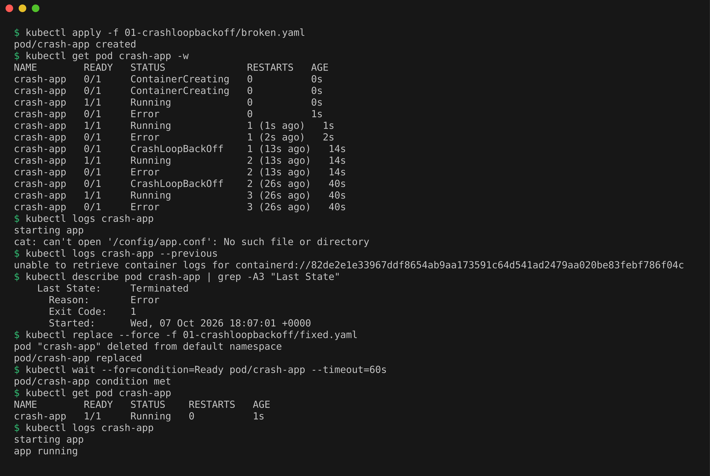
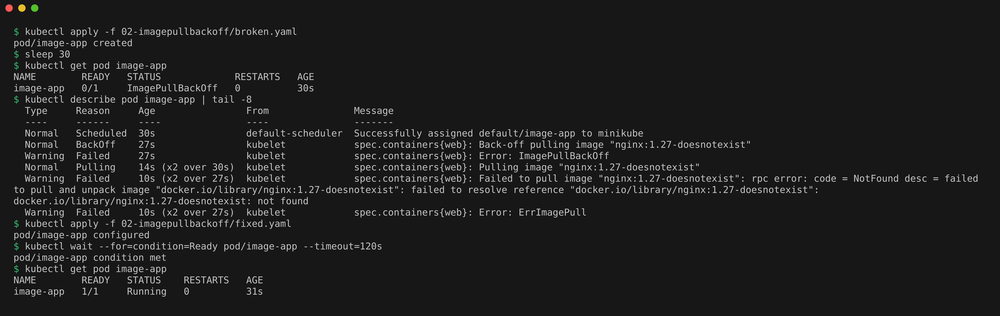
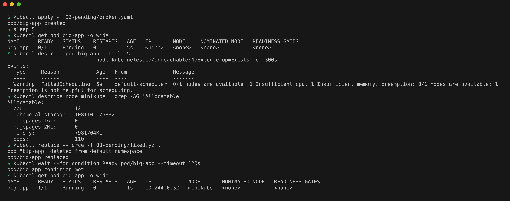
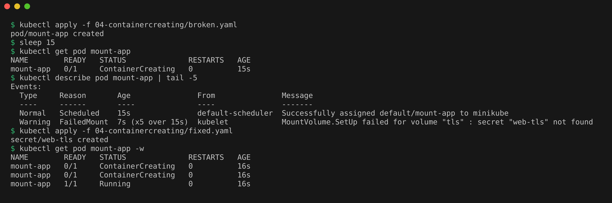
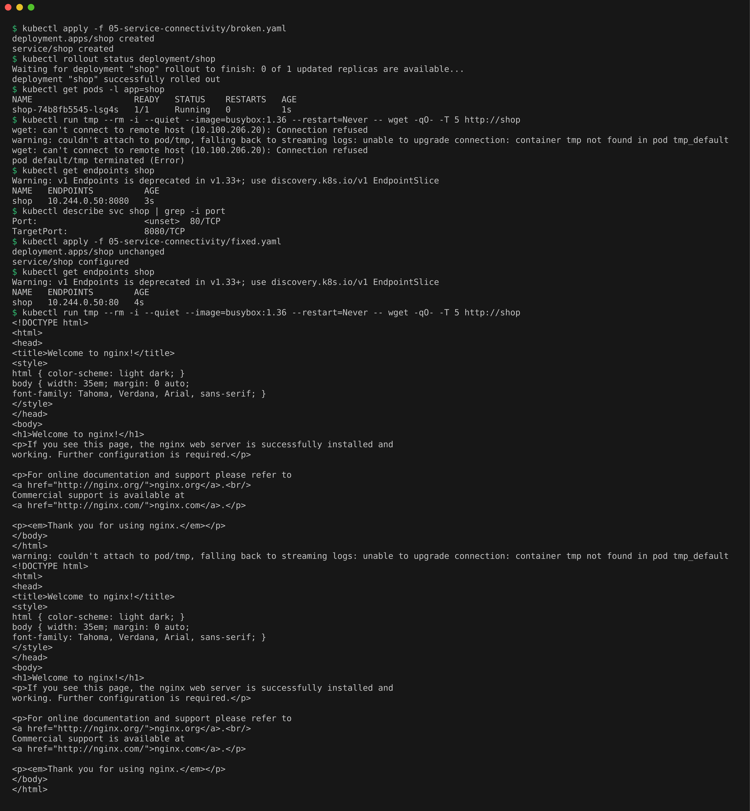
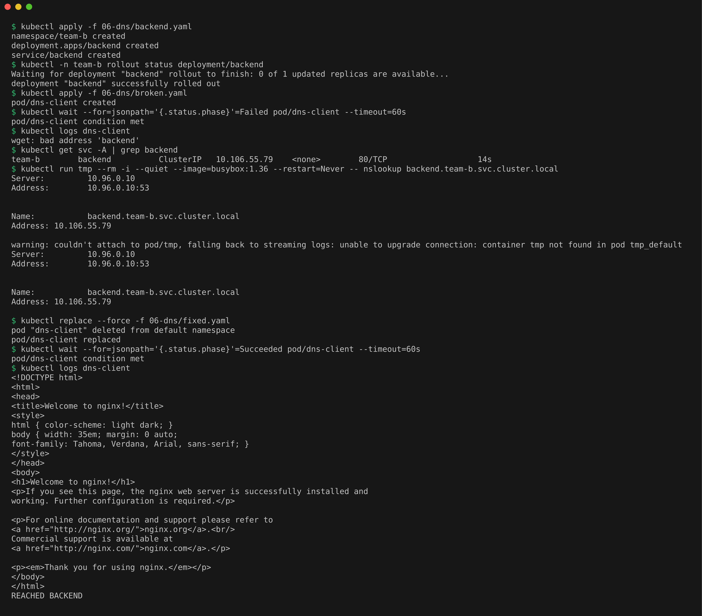
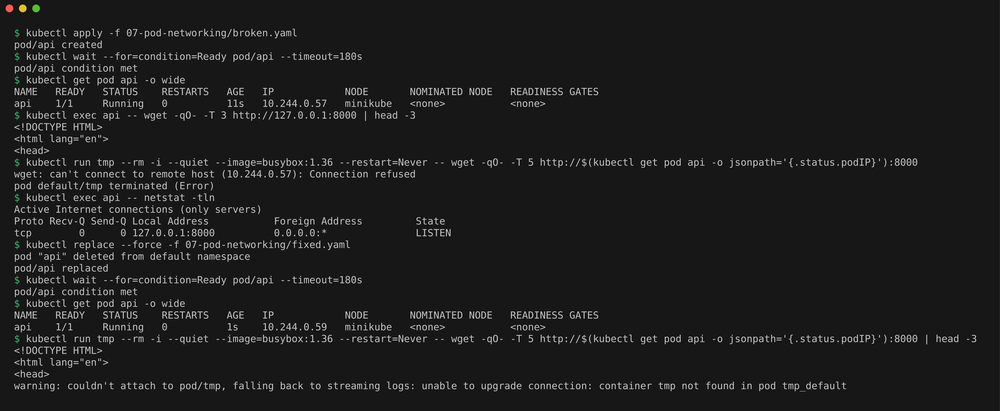
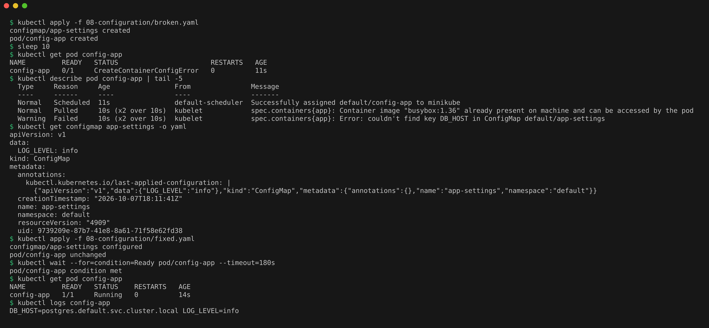

# Troubleshooting Common Kubernetes Issues

Every issue below has a `broken.yaml` that reproduces the failure and a `fixed.yaml` with the fix. For each one I followed the same loop: identify, investigate, root cause, fix, verify.

Some pod fields (like `command` and `resources`) cannot be changed on a running pod, so the fix is applied with `kubectl replace --force`, which deletes the pod and creates it again from the fixed file.

Each screenshot shows the investigate block and the fix block for that issue, run one after the other.

## 1. CrashLoopBackOff

**Identify.** The pod keeps restarting. The STATUS column cycles through `Running`, `Error` and `CrashLoopBackOff`, with RESTARTS going up.

**Investigate.**
```bash
kubectl apply -f 01-crashloopbackoff/broken.yaml
kubectl get pod crash-app -w
kubectl logs crash-app
kubectl logs crash-app --previous
kubectl describe pod crash-app | grep -A3 "Last State"
```
I stopped the watch after about a minute, by which point the pod had restarted 3 times. `kubectl logs` showed `cat: can't open '/config/app.conf': No such file or directory`. `--previous` is meant to show the logs of the container run before the current one, but on my cluster it only returned `unable to retrieve container logs`, so the plain `logs` output and the `Exit Code: 1` under Last State were what explained the crash.

**Root cause.** The container command reads a config file that does not exist and then exits with code 1. Kubernetes restarts it, it exits again, and the delay between restarts keeps growing (that growing delay is the "BackOff").

**Fix and verify.**
```bash
kubectl replace --force -f 01-crashloopbackoff/fixed.yaml
kubectl wait --for=condition=Ready pod/crash-app --timeout=60s
kubectl get pod crash-app
kubectl logs crash-app
```
The pod was `Running` with 0 restarts and the logs showed `app running`.



## 2. ErrImagePull and ImagePullBackOff

**Identify.** Pod status first shows `ErrImagePull`, then switches to `ImagePullBackOff`. They are the same problem: `ErrImagePull` is the first failed pull, `ImagePullBackOff` means Kubernetes is now waiting longer and longer between retries.

**Investigate.**
```bash
kubectl apply -f 02-imagepullbackoff/broken.yaml
sleep 30
kubectl get pod image-app
kubectl describe pod image-app | tail -8
```

**Root cause.** After 30 seconds the status was already `ImagePullBackOff`. The Events show `Failed to pull image "nginx:1.27-doesnotexist"` ending in `not found`, because that tag does not exist on Docker Hub. The same error appears for a misspelled image name or a private registry without credentials.

**Fix and verify.**
```bash
kubectl apply -f 02-imagepullbackoff/fixed.yaml
kubectl wait --for=condition=Ready pod/image-app --timeout=120s
kubectl get pod image-app
```
The image field can be changed on a live pod, so a normal apply was enough (`pod/image-app configured`), and the same pod went to `Running`.



## 3. Pending

**Identify.** Pod stays in `Pending` and never gets a node.

**Investigate.**
```bash
kubectl apply -f 03-pending/broken.yaml
sleep 5
kubectl get pod big-app -o wide
kubectl describe pod big-app | tail -5
kubectl describe node minikube | grep -A6 "Allocatable"
```

**Root cause.** Events show `FailedScheduling ... 0/1 nodes are available: 1 Insufficient cpu, 1 Insufficient memory`. The pod requests 64 CPUs and 64Gi of memory, but the node only has 12 CPUs and about 7.6Gi allocatable, and the scheduler only places a pod on a node with that much unreserved capacity. The NODE column stayed `<none>`.

**Fix and verify.**
```bash
kubectl replace --force -f 03-pending/fixed.yaml
kubectl wait --for=condition=Ready pod/big-app --timeout=120s
kubectl get pod big-app -o wide
```
With the requests lowered to 100m CPU and 64Mi memory, the pod was scheduled on `minikube` and ran.



## 4. ContainerCreating (stuck)

**Identify.** Pod stays in `ContainerCreating` for minutes.

**Investigate.**
```bash
kubectl apply -f 04-containercreating/broken.yaml
sleep 15
kubectl get pod mount-app
kubectl describe pod mount-app | tail -5
```

**Root cause.** Events show `FailedMount ... secret "web-tls" not found`. The pod was scheduled, but the kubelet cannot start the container until every volume is mounted, and the Secret it needs does not exist.

**Fix and verify.**
```bash
kubectl apply -f 04-containercreating/fixed.yaml
kubectl get pod mount-app -w
```
Creating the Secret was enough. The kubelet retried the mount on its own and the pod moved to `Running` within a couple of seconds, without being recreated.



## 5. Service Connectivity

**Identify.** Pod is `Running` and healthy, but calling the service fails.

**Investigate.**
```bash
kubectl apply -f 05-service-connectivity/broken.yaml
kubectl rollout status deployment/shop
kubectl get pods -l app=shop
kubectl run tmp --rm -i --quiet --image=busybox:1.36 --restart=Never -- wget -qO- -T 5 http://shop
kubectl get endpoints shop
kubectl describe svc shop | grep -i port
```

**Root cause.** The request fails with `Connection refused`. Endpoints exist, so the selector is fine, but they point to `10.244.0.50:8080`. The Service has `targetPort: 8080` while nginx listens on port 80, so traffic reaches the pod on a port nothing is listening on.

**Fix and verify.**
```bash
kubectl apply -f 05-service-connectivity/fixed.yaml
kubectl get endpoints shop
kubectl run tmp --rm -i --quiet --image=busybox:1.36 --restart=Never -- wget -qO- -T 5 http://shop
```
Endpoints now show port 80 and the request returns the nginx welcome page. The output of the `tmp` pod is printed twice because the pod finished before kubectl could attach to it, so kubectl fell back to printing its logs as well. `kubectl get endpoints` also warns that v1 Endpoints is deprecated in favour of EndpointSlice, but it still works.



## 6. DNS

**Identify.** A client pod cannot reach a backend by name.

**Investigate.**
```bash
kubectl apply -f 06-dns/backend.yaml
kubectl -n team-b rollout status deployment/backend
kubectl apply -f 06-dns/broken.yaml
kubectl wait --for=jsonpath='{.status.phase}'=Failed pod/dns-client --timeout=60s
kubectl logs dns-client
kubectl get svc -A | grep backend
kubectl run tmp --rm -i --quiet --image=busybox:1.36 --restart=Never -- nslookup backend.team-b.svc.cluster.local
```

**Root cause.** The client took about 15 seconds to give up and then logged `wget: bad address 'backend'`. The client runs in `default`, but the `backend` Service lives in namespace `team-b`. A short name only resolves inside the caller's own namespace, so `backend` was looked up as `backend.default.svc.cluster.local`, which does not exist. nslookup proves CoreDNS resolves the full name fine.

**Fix and verify.**
```bash
kubectl replace --force -f 06-dns/fixed.yaml
kubectl wait --for=jsonpath='{.status.phase}'=Succeeded pod/dns-client --timeout=60s
kubectl logs dns-client
```
With the FQDN `backend.team-b.svc.cluster.local` the client prints the nginx page and `REACHED BACKEND`.



## 7. Pod Networking

**Identify.** The app works from inside its own pod, but other pods cannot reach it by pod IP.

**Investigate.**
```bash
kubectl apply -f 07-pod-networking/broken.yaml
kubectl wait --for=condition=Ready pod/api --timeout=180s
kubectl get pod api -o wide
kubectl exec api -- wget -qO- -T 3 http://127.0.0.1:8000 | head -3
kubectl run tmp --rm -i --quiet --image=busybox:1.36 --restart=Never -- wget -qO- -T 5 http://$(kubectl get pod api -o jsonpath='{.status.podIP}'):8000
kubectl exec api -- netstat -tln
```

**Root cause.** From inside the pod the request works, from another pod it gets `Connection refused`. netstat shows the server listening on `127.0.0.1:8000`. 127.0.0.1 (localhost) only accepts connections from inside the same pod, so traffic arriving on the pod IP is rejected.

**Fix and verify.**
```bash
kubectl replace --force -f 07-pod-networking/fixed.yaml
kubectl wait --for=condition=Ready pod/api --timeout=180s
kubectl get pod api -o wide
kubectl run tmp --rm -i --quiet --image=busybox:1.36 --restart=Never -- wget -qO- -T 5 http://$(kubectl get pod api -o jsonpath='{.status.podIP}'):8000 | head -3
```
Bound to `0.0.0.0` (all interfaces), the other pod now gets the first lines of the directory listing page. The pod IP changed after recreating (10.244.0.57 before, 10.244.0.59 after), which is why the command looks it up each time instead of hardcoding it.



## 8. Configuration Issue

**Identify.** Pod status shows `CreateContainerConfigError`.

**Investigate.**
```bash
kubectl apply -f 08-configuration/broken.yaml
sleep 10
kubectl get pod config-app
kubectl describe pod config-app | tail -5
kubectl get configmap app-settings -o yaml
```

**Root cause.** Events show `couldn't find key DB_HOST in ConfigMap default/app-settings`. The pod reads two env variables from the ConfigMap, but the ConfigMap only has `LOG_LEVEL`. Kubernetes refuses to start a container when a required config value is missing.

**Fix and verify.**
```bash
kubectl apply -f 08-configuration/fixed.yaml
kubectl wait --for=condition=Ready pod/config-app --timeout=180s
kubectl get pod config-app
kubectl logs config-app
```
Added `DB_HOST` to the ConfigMap. The kubelet retried by itself, the pod moved to `Running` a few seconds later, and the logs print both values.



## Cleanup

```bash
kubectl delete -f 01-crashloopbackoff/fixed.yaml -f 02-imagepullbackoff/fixed.yaml -f 03-pending/fixed.yaml -f 04-containercreating/broken.yaml -f 04-containercreating/fixed.yaml -f 05-service-connectivity/fixed.yaml -f 06-dns/fixed.yaml -f 06-dns/backend.yaml -f 07-pod-networking/fixed.yaml -f 08-configuration/fixed.yaml
```
