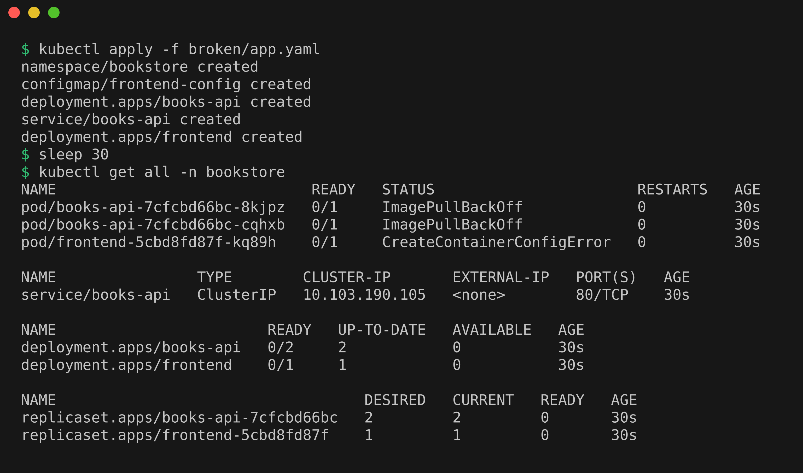
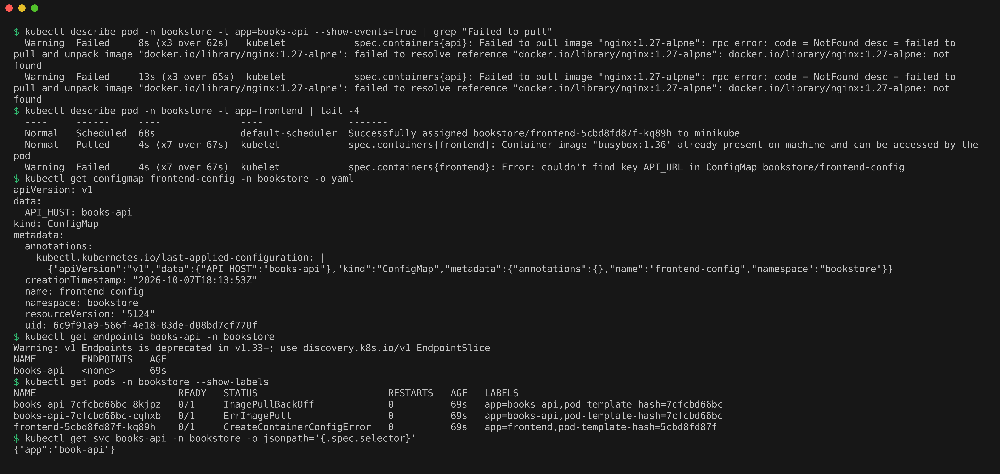
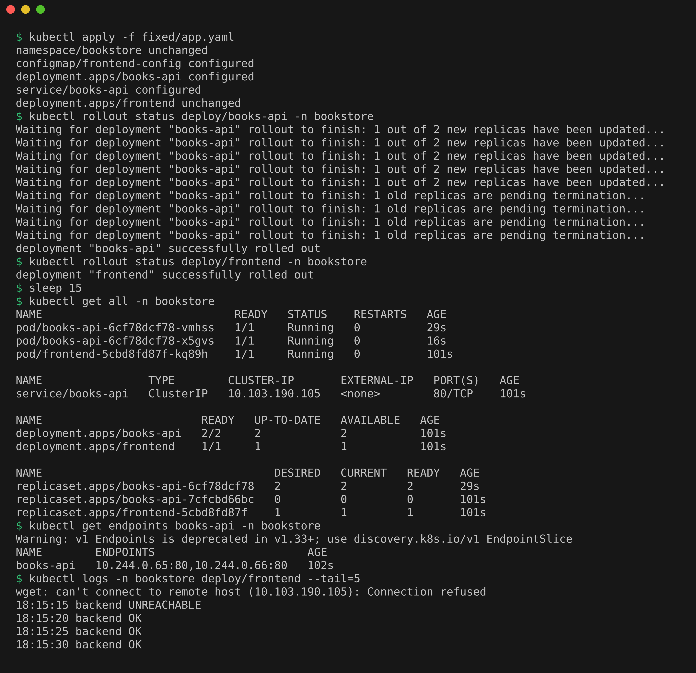

# Mini Project: Fixing a Broken Bookstore

## Problem Statement

The bookstore app has two parts in the `bookstore` namespace:
- `books-api`, an nginx backend with 2 replicas behind a Service.
- `frontend`, a pod that calls the backend every 5 seconds and logs `backend OK` or `backend UNREACHABLE`.

After deploying `broken/app.yaml`, nothing works: the frontend never starts and the backend is not reachable. The goal is to find every problem with kubectl alone, fix it, and prove it works.

## Before

```bash
kubectl apply -f broken/app.yaml
sleep 30
kubectl get all -n bookstore
```

After 30 seconds both `books-api` pods sat in `ImagePullBackOff` and the frontend pod was in `CreateContainerConfigError`. Both deployments showed 0 ready.



## Investigation

```bash
kubectl describe pod -n bookstore -l app=books-api --show-events=true | grep "Failed to pull"
kubectl describe pod -n bookstore -l app=frontend | tail -4
kubectl get configmap frontend-config -n bookstore -o yaml
kubectl get endpoints books-api -n bookstore
kubectl get pods -n bookstore --show-labels
kubectl get svc books-api -n bookstore -o jsonpath='{.spec.selector}'
```

The books-api pods failed to pull `nginx:1.27-alpne` (`not found`). The frontend event says `couldn't find key API_URL in ConfigMap bookstore/frontend-config`, and the ConfigMap only has `API_HOST`. The Service had `<none>` for endpoints, and its selector `{"app":"book-api"}` does not match the pod label `app=books-api`.

One thing I ran into: when `kubectl describe pod -l ...` matches more than one pod it leaves out the Events section, so my first grep for `Failed` came back empty. Adding `--show-events=true` brought the events back.



## Root Causes

| # | Symptom | Root cause |
|---|---|---|
| 1 | books-api in ImagePullBackOff | Image tag typo `nginx:1.27-alpne`, should be `nginx:1.27-alpine` |
| 2 | frontend in CreateContainerConfigError | Pod reads key `API_URL` from the ConfigMap, but the ConfigMap defines `API_HOST` |
| 3 | Service books-api has no endpoints | Service selector is `app: book-api`, pods are labeled `app: books-api` |

Bug 3 was hidden behind bug 1. Even after the image is fixed and pods are Running, the frontend would still log `backend UNREACHABLE`, because a Service with a non-matching selector has no endpoints to send traffic to.

## Solution

Fixed all three in `fixed/app.yaml` (compare with `diff broken/app.yaml fixed/app.yaml`) and applied it:

```bash
kubectl apply -f fixed/app.yaml
kubectl rollout status deploy/books-api -n bookstore
kubectl rollout status deploy/frontend -n bookstore
```

## After

```bash
sleep 15
kubectl get all -n bookstore
kubectl get endpoints books-api -n bookstore
kubectl logs -n bookstore deploy/frontend --tail=5
```

All pods were `Running`, the Service had 2 endpoints (one per backend pod), and the frontend logged `backend OK` every 5 seconds. The single `backend UNREACHABLE` line at the top is from the few seconds when the frontend had already started (its ConfigMap fix needs no new pod) but the new backend pods were still rolling out. The screenshot shows the Solution and After blocks together.



## Cleanup

```bash
kubectl delete namespace bookstore
```
