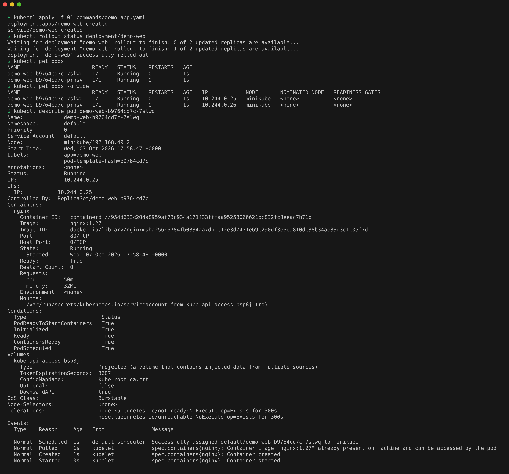
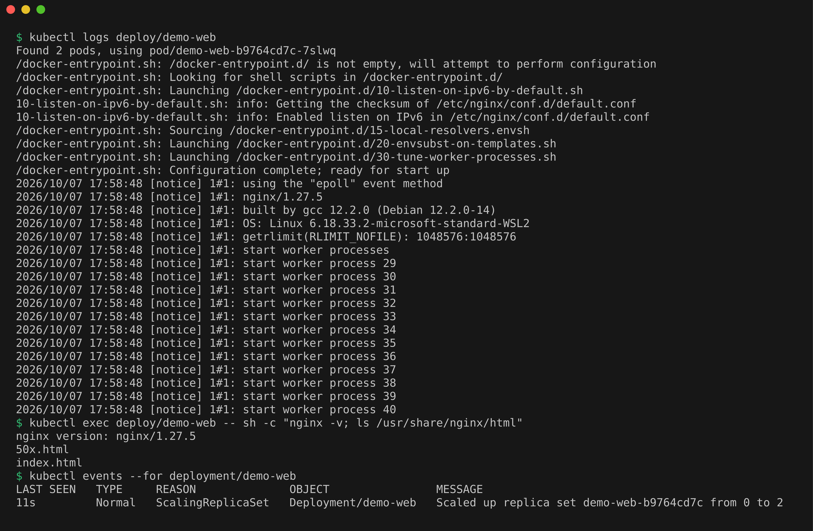
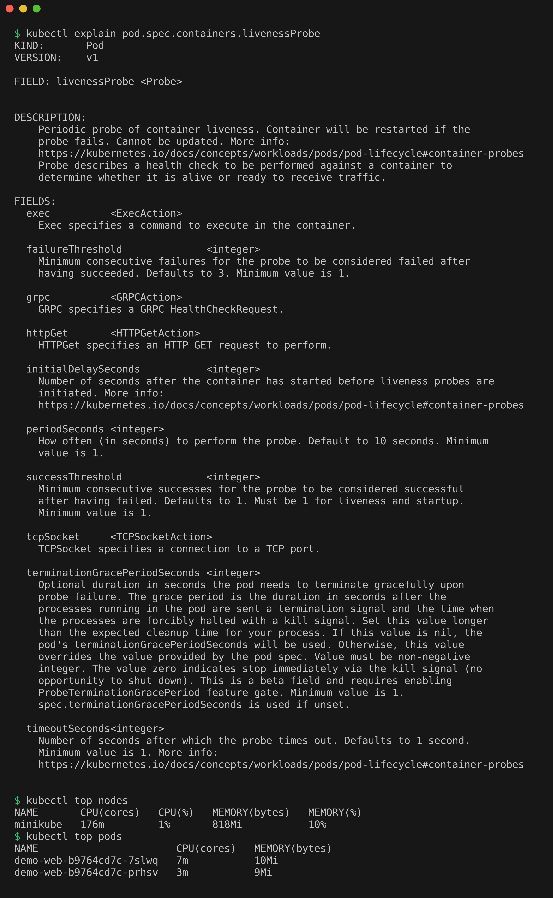

# Kubernetes Troubleshooting Homework

## Task 1: Troubleshooting Commands

Deployed a small nginx app with 2 replicas and used it to try each command.

```bash
kubectl apply -f 01-commands/demo-app.yaml
kubectl rollout status deployment/demo-web
kubectl get pods
kubectl get pods -o wide
kubectl describe pod demo-web-b9764cd7c-7slwq
```

`get`, `get -o wide` and `describe` on the demo pods.



```bash
kubectl logs deploy/demo-web
kubectl exec deploy/demo-web -- sh -c "nginx -v; ls /usr/share/nginx/html"
kubectl events --for deployment/demo-web
```

`logs`, `exec` and `events` for the deployment.



```bash
kubectl explain pod.spec.containers.livenessProbe
kubectl top nodes
kubectl top pods
```

`explain` for the livenessProbe field, and `top` for the node and pods.



## Task 2: Troubleshooting Common Issues

Recreated 8 common failures, each with a broken and a fixed manifest: CrashLoopBackOff, ImagePullBackOff, Pending, ContainerCreating, Service connectivity, DNS, pod networking and a configuration error. Write-up in [02-issues/README.md](02-issues/README.md).

## Task 3: Mini Project, Broken Bookstore

A bookstore app with three planted bugs, found and fixed with kubectl. Write-up in [03-mini-project/README.md](03-mini-project/README.md).

## Cleanup

```bash
kubectl delete -f 01-commands/demo-app.yaml
```
