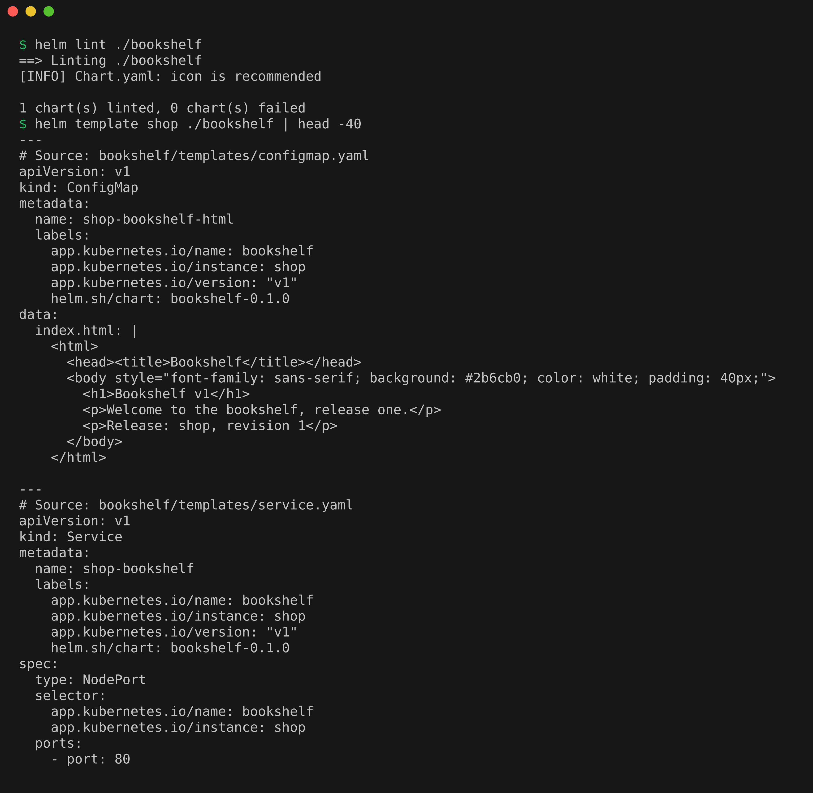
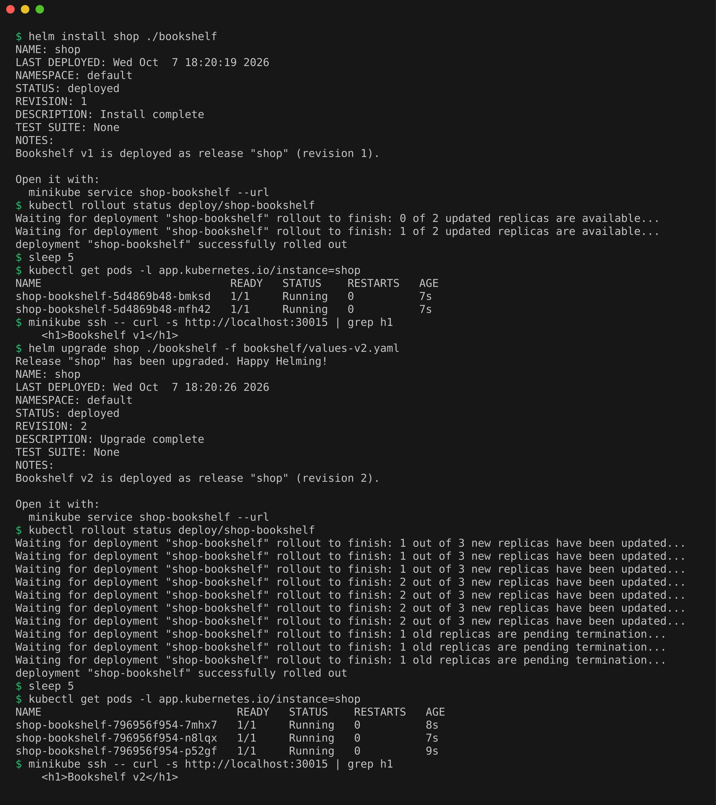
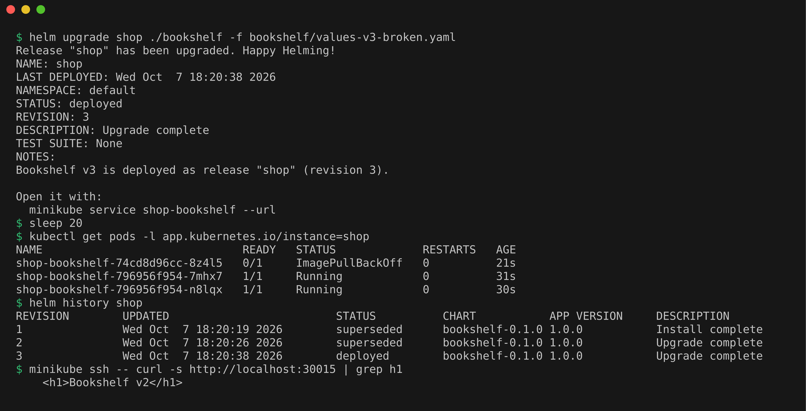
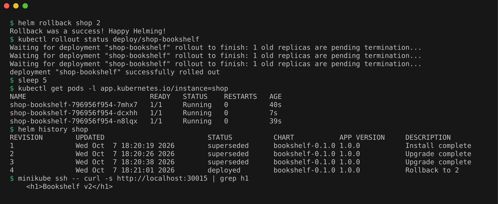

# Mini Project: Bookshelf Helm Chart

A chart written by hand for a static site. nginx serves a page built from values, so each release shows its own version.

## Chart structure

`Chart.yaml`, `values.yaml` with `values-v2.yaml` and `values-v3-broken.yaml` as overrides, and templates for a ConfigMap (the page), a Deployment, a Service and NOTES. A checksum annotation on the Deployment restarts the pods when the page changes.

## Lint and render

```bash
helm lint ./bookshelf
helm template shop ./bookshelf | head -40
```

Lint passed, and the rendered page says `Bookshelf v1`.



## Install (revision 1) and upgrade (revision 2)

```bash
helm install shop ./bookshelf
kubectl rollout status deploy/shop-bookshelf
sleep 5
kubectl get pods -l app.kubernetes.io/instance=shop
minikube ssh -- curl -s http://localhost:30015 | grep h1
helm upgrade shop ./bookshelf -f bookshelf/values-v2.yaml
kubectl rollout status deploy/shop-bookshelf
sleep 5
kubectl get pods -l app.kubernetes.io/instance=shop
minikube ssh -- curl -s http://localhost:30015 | grep h1
```

v1 runs 2 pods, and after the upgrade v2 runs 3 pods.



## Broken upgrade (revision 3)

```bash
helm upgrade shop ./bookshelf -f bookshelf/values-v3-broken.yaml
sleep 20
kubectl get pods -l app.kubernetes.io/instance=shop
helm history shop
minikube ssh -- curl -s http://localhost:30015 | grep h1
```

The new pod is stuck in `ImagePullBackOff`, the old pods still serve v2, and Helm still marks revision 3 as `deployed`.



## Rollback (revision 4)

```bash
helm rollback shop 2
kubectl rollout status deploy/shop-bookshelf
sleep 5
kubectl get pods -l app.kubernetes.io/instance=shop
helm history shop
minikube ssh -- curl -s http://localhost:30015 | grep h1
```

Back to 3 healthy pods on v2, with revision 4 as `Rollback to 2`.



## Cleanup

```bash
helm uninstall shop
```
