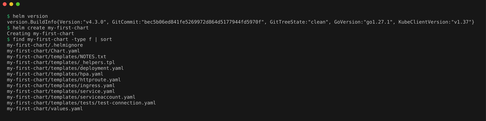
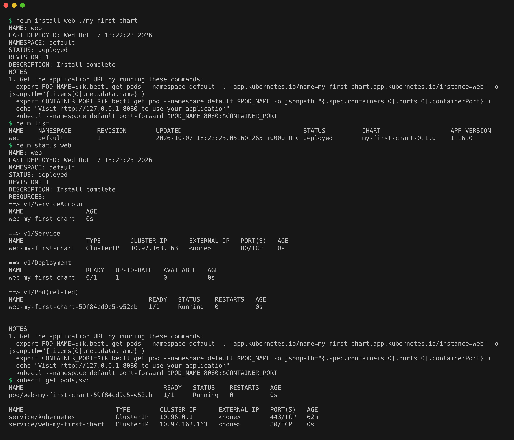
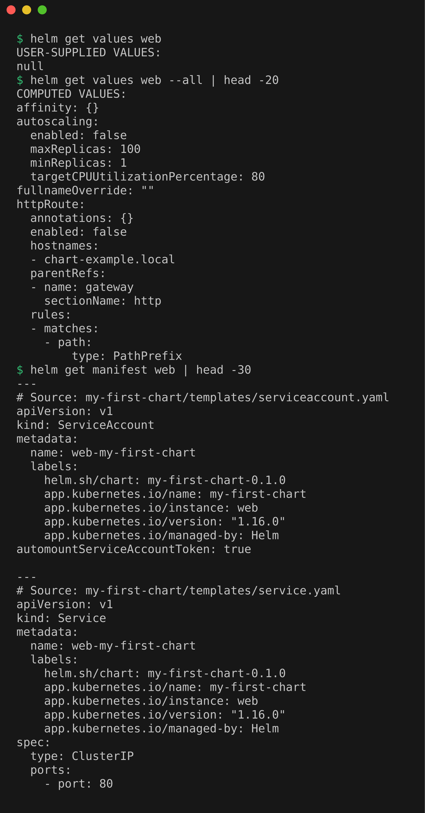
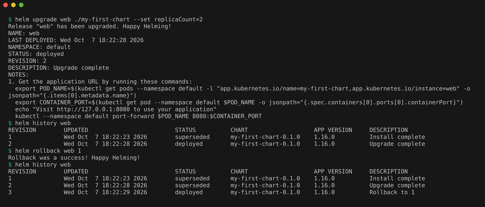
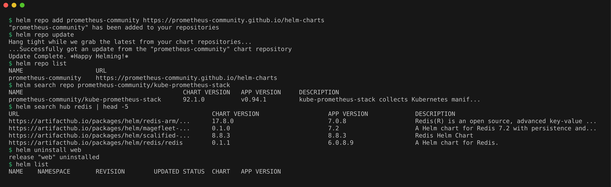
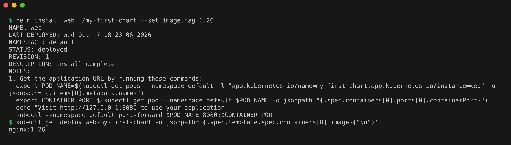
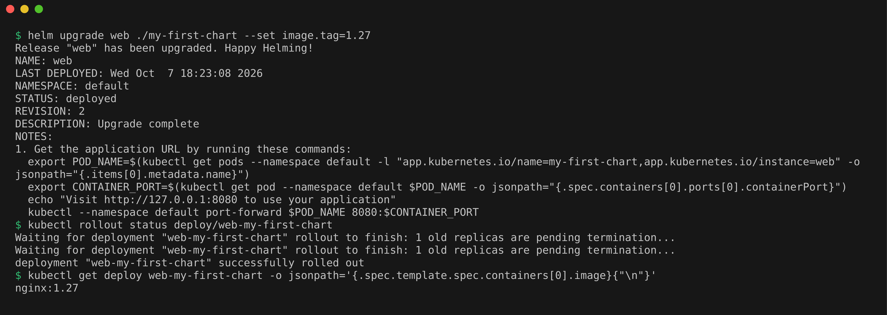
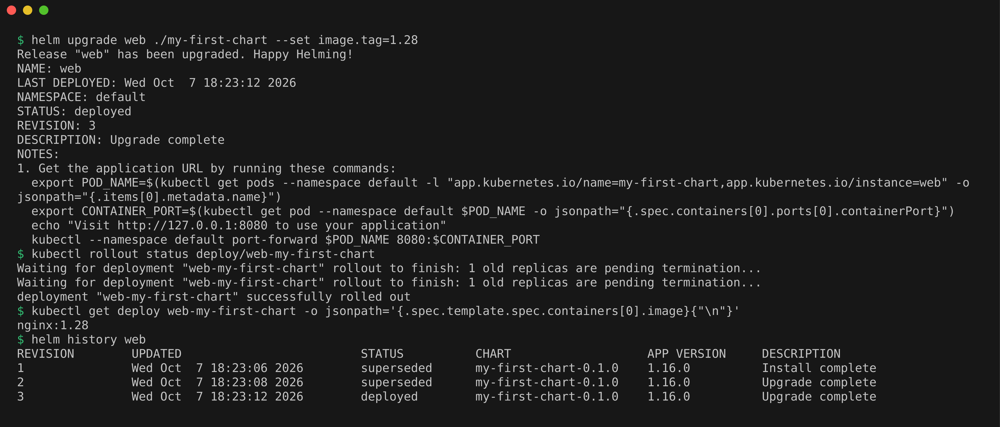
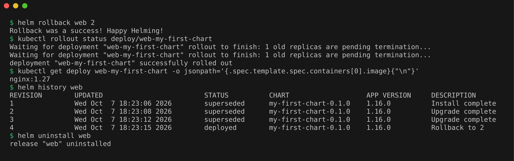

# Helm Homework

A chart is templated YAML plus default values, a release is one installed copy of it, and every change makes a new revision.

## Task 1: Helm Commands

### helm create

```bash
helm version
helm create my-first-chart
find my-first-chart -type f | sort
```

`helm create` generated a starter chart that deploys nginx.



### helm install, list, status

```bash
helm install web ./my-first-chart
helm list
helm status web
kubectl get pods,svc
```

Release `web` deployed at revision 1 with its pod running.



### helm get

```bash
helm get values web
helm get values web --all | head -20
helm get manifest web | head -30
```

No user values yet, then the computed values and the rendered manifest.



### helm upgrade, history, rollback

```bash
helm upgrade web ./my-first-chart --set replicaCount=2
helm history web
helm rollback web 1
helm history web
```

The upgrade made revision 2, and the rollback to 1 was recorded as revision 3.



### helm repo, search, uninstall

```bash
helm repo add prometheus-community https://prometheus-community.github.io/helm-charts
helm repo update
helm repo list
helm search repo prometheus-community/kube-prometheus-stack
helm search hub redis | head -5
helm uninstall web
helm list
```

Added and searched the prometheus-community repo, searched Artifact Hub, then uninstalled `web`.



## Task 2: Helm Rollback Workflow

Install, upgrade twice and roll back, changing the nginx image tag each time.

### Install (revision 1)

```bash
helm install web ./my-first-chart --set image.tag=1.26
kubectl get deploy web-my-first-chart -o jsonpath='{.spec.template.spec.containers[0].image}{"\n"}'
```

Revision 1 runs `nginx:1.26`.



### Upgrade and verify (revision 2)

```bash
helm upgrade web ./my-first-chart --set image.tag=1.27
kubectl rollout status deploy/web-my-first-chart
kubectl get deploy web-my-first-chart -o jsonpath='{.spec.template.spec.containers[0].image}{"\n"}'
```

Revision 2 runs `nginx:1.27`.



### Upgrade again and verify (revision 3)

```bash
helm upgrade web ./my-first-chart --set image.tag=1.28
kubectl rollout status deploy/web-my-first-chart
kubectl get deploy web-my-first-chart -o jsonpath='{.spec.template.spec.containers[0].image}{"\n"}'
helm history web
```

Revision 3 runs `nginx:1.28`.



### Rollback and verify (revision 4)

```bash
helm rollback web 2
kubectl rollout status deploy/web-my-first-chart
kubectl get deploy web-my-first-chart -o jsonpath='{.spec.template.spec.containers[0].image}{"\n"}'
helm history web
helm uninstall web
```

Rolled back to revision 2 as revision 4, and the image is `nginx:1.27` again.



## Task 3: Mini Project, Bookshelf Chart

A hand-written chart for a small static site, with an install, an upgrade, a broken upgrade and a rollback. Write-up in [03-mini-project/README.md](03-mini-project/README.md).
