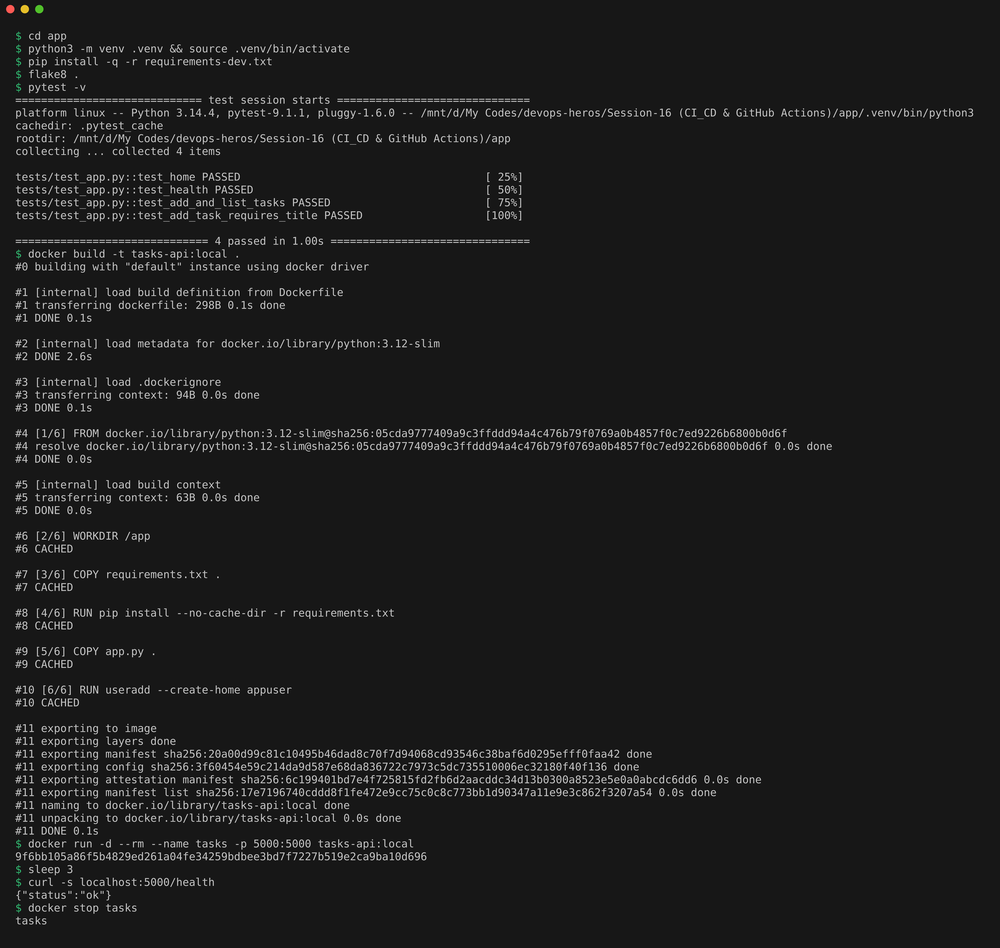
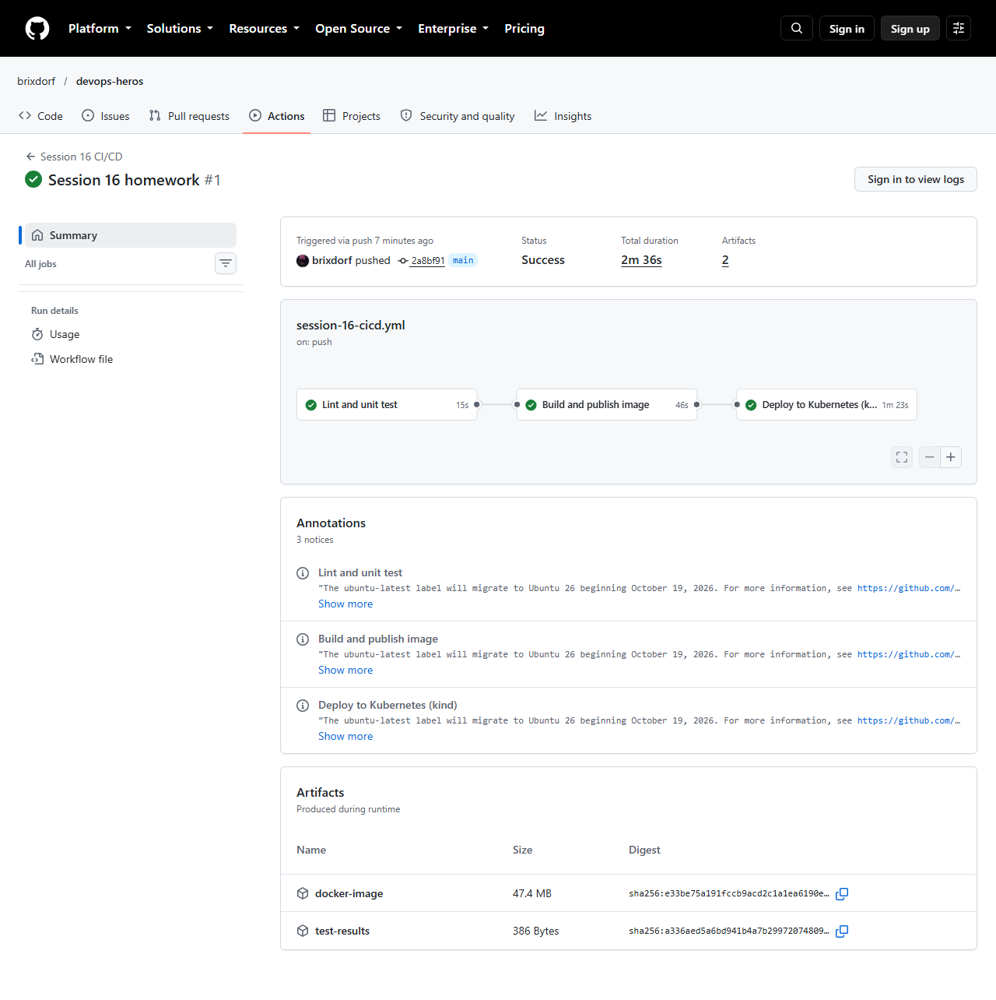
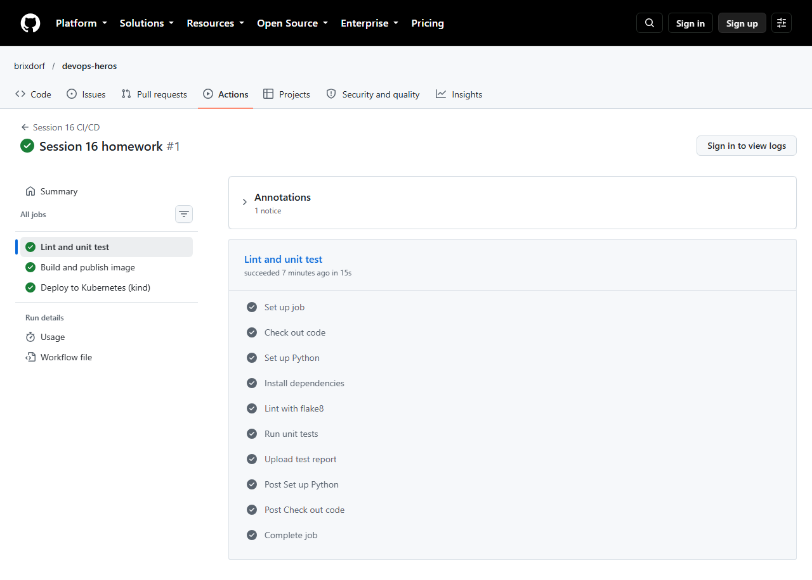
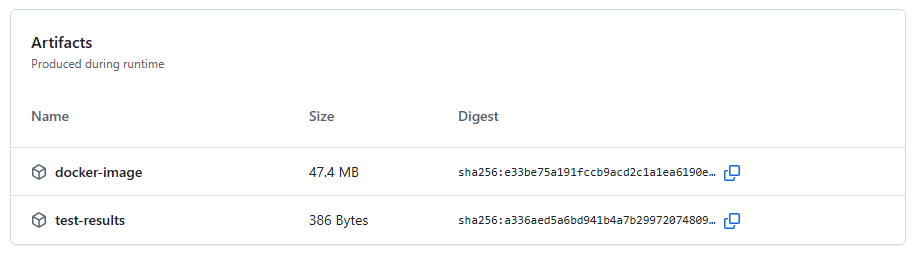
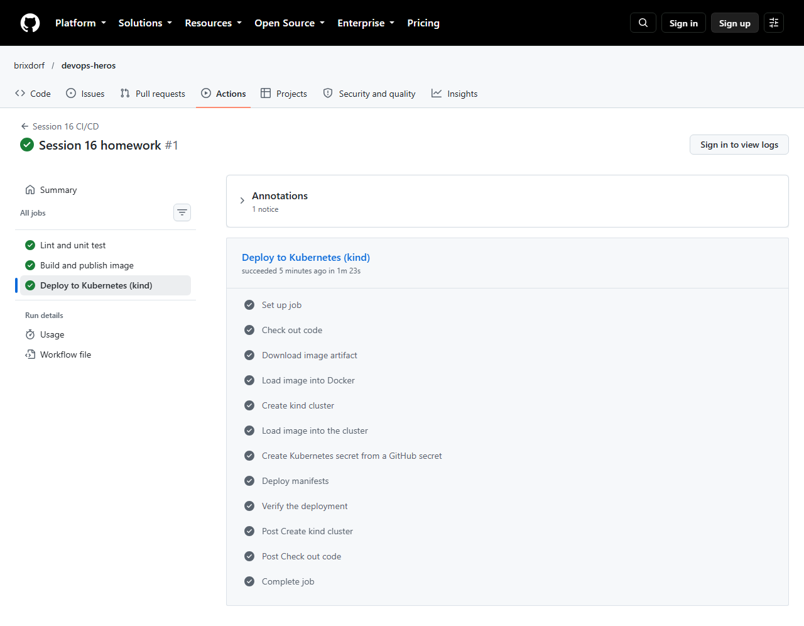
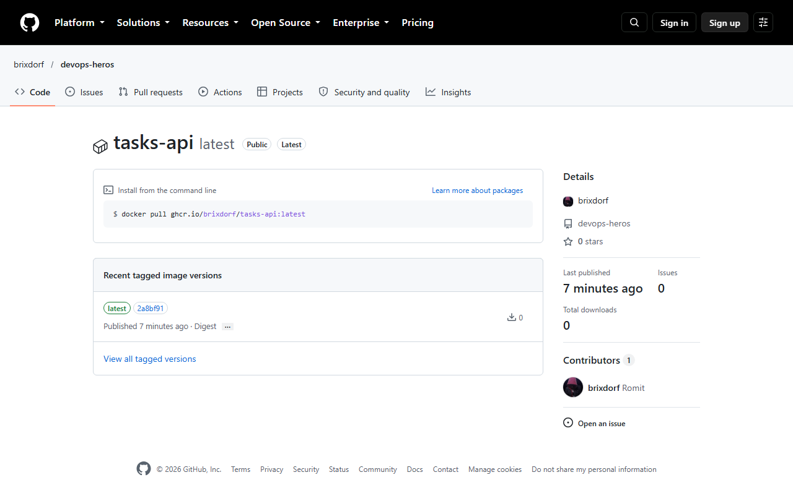

# CI/CD & GitHub Actions Homework

## Demo Project: Tasks API with a Full CI/CD Pipeline

A small Flask REST API (`app/`) that stores a to-do list in memory, with unit tests, a Dockerfile, Kubernetes manifests (`k8s/`), and a GitHub Actions pipeline that tests it, builds it, publishes it and deploys it.

```text
Session-16 (CI_CD & GitHub Actions)/
├── app/
│   ├── app.py                 Flask API: /, /health, /tasks
│   ├── tests/test_app.py      4 pytest unit tests
│   ├── requirements.txt       runtime dependencies
│   ├── requirements-dev.txt   adds pytest and flake8
│   └── Dockerfile             python:3.12-slim, gunicorn, non-root user
└── k8s/
    ├── deployment.yaml        2 replicas, probes, secret as env var
    └── service.yaml
.github/workflows/session-16-cicd.yml   (at the repo root)
```

The workflow file has to live in `.github/workflows/` at the root of the repository, because that is the only place GitHub looks for workflows. The `paths` filter makes it run only when something in this session's folder changes.

## Concepts, mapped to this project

**CI vs CD.** CI (Continuous Integration) means every push is automatically built and tested, so broken code is caught within minutes. CD (Continuous Delivery or Deployment) takes the build that passed CI and ships it to an environment automatically. Here the `test` and `build` jobs are CI, and the `deploy` job is CD.

**CI/CD pipeline.** The whole chain from a push to a running deployment: lint, unit test, Docker build, smoke test, push to registry, deploy, verify. If any step fails, everything after it is skipped.

**GitHub Actions.** GitHub's built-in automation service that runs these pipelines on events like a push or a pull request.

**Workflow.** One YAML file in `.github/workflows/`. It declares the triggers (`on: push`, `pull_request`, `workflow_dispatch` for a manual run button) and the jobs.

**Jobs.** Groups of steps that each run on a fresh machine. Jobs run in parallel unless `needs:` chains them. Here it is `test`, then `build`, then `deploy`.

**Steps.** The individual commands inside a job. A step either runs a shell command (`run:`) or uses a reusable action (`uses: actions/checkout@v7`).

**Runners.** The machines that execute jobs. `runs-on: ubuntu-latest` uses a fresh GitHub-hosted Ubuntu VM for every job, which is thrown away afterwards.

**Secrets.** Encrypted values stored in the repo settings and injected at runtime, always masked as `***` in logs. The pipeline uses `GITHUB_TOKEN` (created automatically for every run) to log in to GitHub Container Registry, and an optional repository secret `APP_GREETING` (with a default when it is not set) that becomes a Kubernetes Secret and then an env variable inside the app.

**Artifacts.** Files saved from a job so they can be downloaded later or used by another job. This pipeline uploads `test-results.xml` (the test report) and `image.tar` (the built image), which the deploy job downloads so it deploys exactly the image that passed CI.

**Build and test.** `flake8` checks code style, `pytest` runs the unit tests, and `docker build` produces the image. The smoke test runs the container and calls `/health` before anything gets published.

**Pipeline execution.** Each push to `main` that touches this folder runs the 3 jobs in order. The CD job creates a temporary Kubernetes cluster inside the runner with kind (Kubernetes in Docker), loads the image, applies the manifests, waits for the rollout and calls the API through `kubectl port-forward`.

## Running it locally first

```bash
cd app
python3 -m venv .venv && source .venv/bin/activate
pip install -q -r requirements-dev.txt
flake8 .
pytest -v
docker build -t tasks-api:local .
docker run -d --rm --name tasks -p 5000:5000 tasks-api:local
sleep 3
curl -s localhost:5000/health
docker stop tasks
```

flake8 printed nothing, which means no style problems. All 4 tests passed, the image built (the layers show `CACHED` because I had already built it once), and the container answered `/health` with `{"status":"ok"}`.



## Pipeline Execution on GitHub

Pushed to `main`, and the push started the workflow on its own. I did not add the optional repository secret `APP_GREETING`, so the deploy job used the default greeting built into the workflow (`Hello from GitHub Actions`).

All 3 jobs passed in 2m 36s, chained by `needs:`.



The `Lint and unit test` job, with every step green including `Lint with flake8` and `Run unit tests`. GitHub only shows the log text to signed-in users, so this screenshot of the public page shows the step list and not the pytest output.



`docker-image` (47.4 MB) and `test-results` artifacts attached to the run.



Deploy job, every step green. `Deploy manifests` only passes when `kubectl rollout status` finishes on the kind cluster, and `Verify the deployment` only passes when curl gets an answer from `/` and `/health`.



The published image in GitHub Container Registry, tagged `latest` and `2a8bf91` (the commit that was built).


