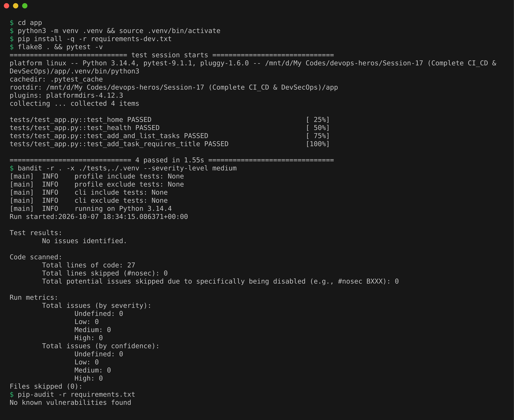
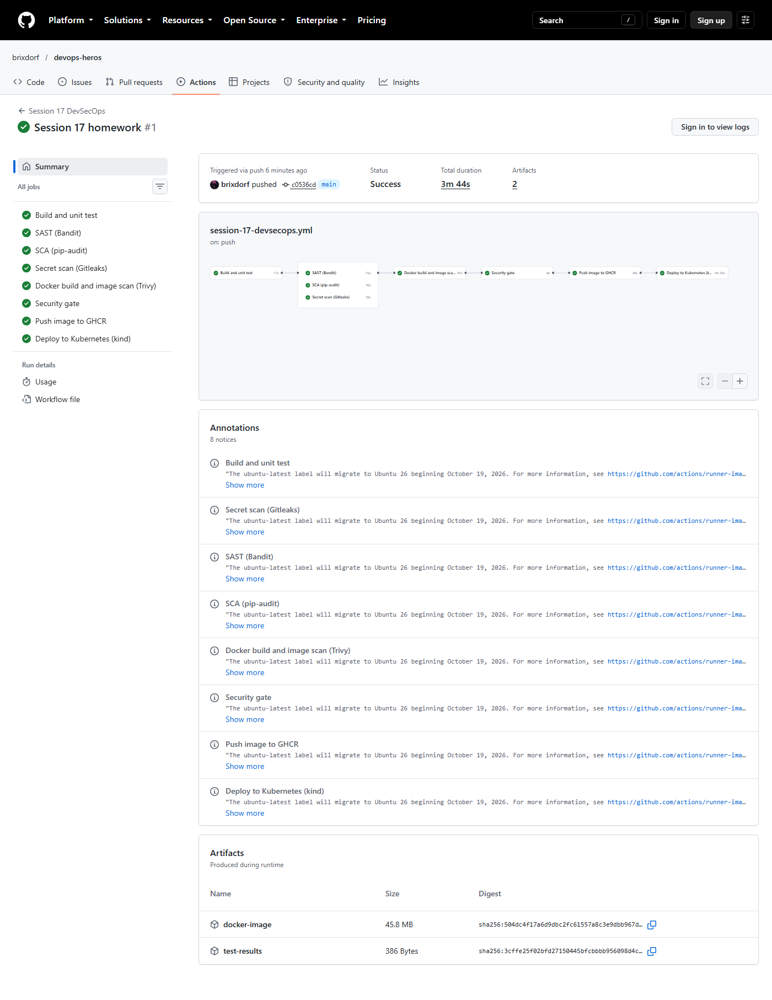
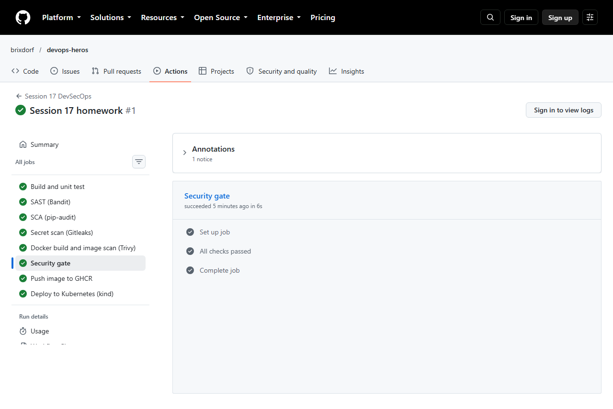
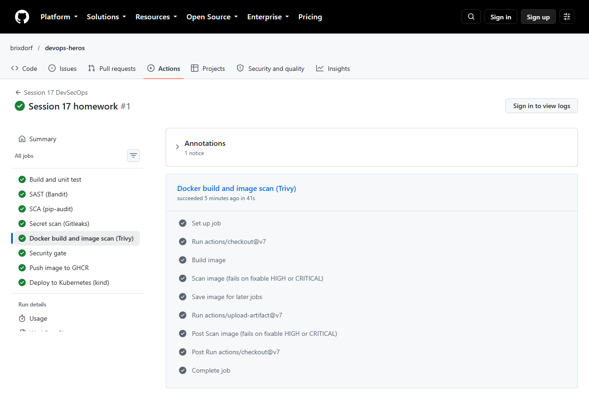
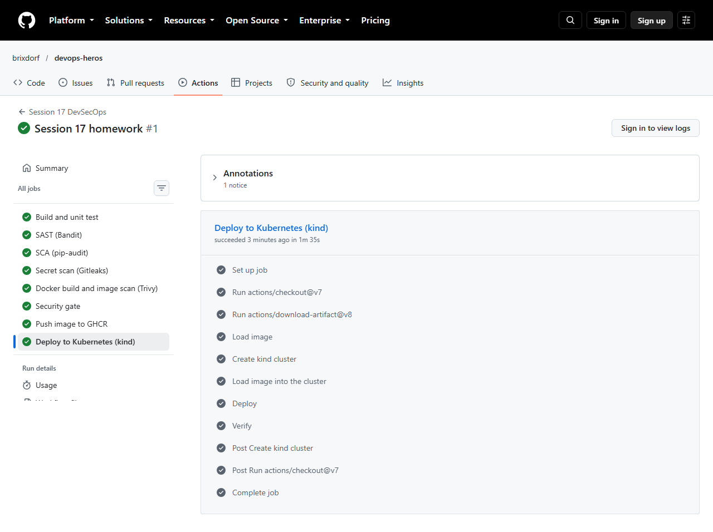
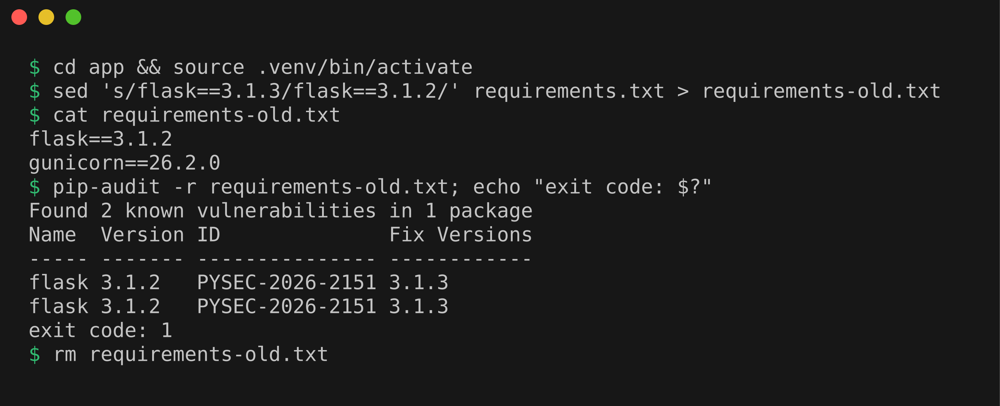

# Complete CI/CD & DevSecOps Homework

## Demo Project: Secure API Pipeline

DevSecOps means building security checks into the same automated pipeline as build and test, so a security problem stops a release just like a failing test does, instead of being found by a separate team weeks later. This is often called "shifting security left" (earlier in the timeline).

The app is a small Flask API (`app/`). The pipeline is `.github/workflows/session-17-devsecops.yml` at the repo root.

```text
Session-17 (Complete CI_CD & DevSecOps)/
├── app/
│   ├── app.py, tests/            Flask API and pytest unit tests
│   ├── requirements.txt          pinned runtime dependencies
│   ├── requirements-dev.txt      adds pytest, flake8, bandit, pip-audit
│   └── Dockerfile                multi-stage, no pip at runtime, non-root user 10001
├── k8s/
│   ├── namespace.yaml
│   ├── deployment.yaml           hardened securityContext
│   └── service.yaml
└── .gitleaks.toml                secret scan configuration
```

## Pipeline Flow

```text
Code -> Build -> Unit Test -> SAST -> SCA -> Secret Scan -> Docker Build
     -> Container Image Scan -> Security Gate -> Push Image -> Deploy to Kubernetes
```

| Stage | Job | Tool | Fails the pipeline when |
|---|---|---|---|
| Build + unit test | build-test | flake8, pytest | lint error or failing test |
| SAST | sast | Bandit | medium or high severity issue in our code |
| SCA | sca | pip-audit | any dependency has a known vulnerability |
| Secret scanning | secret-scan | Gitleaks | a key, token or password is found |
| Docker build + image scan | image-scan | docker, Trivy | fixable HIGH or CRITICAL CVE in the image |
| Security gate | security-gate | (needs all above) | any earlier job failed |
| Container registry | push-image | GHCR | push fails |
| Kubernetes deployment | deploy | kind, kubectl | rollout or health check fails |

SAST, SCA and secret scanning run in parallel after the tests, which keeps the pipeline fast.

## Security Tools Explained

**SAST (Static Application Security Testing)** reads source code without running it, looking for dangerous patterns. Bandit is a SAST tool for Python. It flagged a real issue in my first draft: `app.run(host="0.0.0.0")` (B104, binding to all network interfaces). I changed the local dev server to `127.0.0.1`. Inside the container gunicorn still binds to `0.0.0.0`, because that is required for the container to be reachable at all.

**SCA (Software Composition Analysis)** checks third-party libraries against vulnerability databases. pip-audit failed my first draft too, because `flask==3.1.2` has a published advisory (PYSEC-2026-2151) fixed in `3.1.3`. Bumping the pin fixed it.

**Secret scanning** looks for credentials committed by mistake (AWS keys, GitHub tokens, private keys). Gitleaks scans this session folder with its built-in rules.

**Container image scanning** checks everything inside the final image: OS packages from Debian and every Python package. Trivy first reported HIGH CVEs in libraries that pip bundles inside itself (`urllib3`, `msgpack`), even though the app never uses pip at runtime. The fix was a multi-stage Dockerfile: dependencies are installed in a builder stage, and pip is removed from the final image entirely. `ignore-unfixed: true` means CVEs with no fix available yet do not block the build, because there would be nothing to upgrade to.

**Security gate** is the single job that every scan feeds into. Push and deploy depend on it, so nothing reaches the registry or the cluster unless every check passed. It also writes a summary table to the run page.

**Supply chain hardening.** The Trivy action is pinned to a full commit SHA instead of a tag, because tags can be moved to point at different code.

## Kubernetes Hardening

`deployment.yaml` runs the pod with:
- `runAsNonRoot: true` and `runAsUser: 10001`, so the container can never run as root.
- `readOnlyRootFilesystem: true`, with an emptyDir only at `/tmp` for gunicorn.
- `allowPrivilegeEscalation: false` and all Linux capabilities dropped.
- `seccompProfile: RuntimeDefault`, which blocks unusual system calls.
- `automountServiceAccountToken: false`, because the app never talks to the Kubernetes API.
- CPU and memory requests and limits, plus readiness and liveness probes on `/health`.

## Local Checks Before Pushing

```bash
cd app
python3 -m venv .venv && source .venv/bin/activate
pip install -q -r requirements-dev.txt
flake8 . && pytest -v
bandit -r . -x ./tests,./.venv --severity-level medium
pip-audit -r requirements.txt
```

flake8 was silent, all 4 tests passed, Bandit reported `No issues identified` over 27 lines of code, and pip-audit printed `No known vulnerabilities found`. Locally I had to add `./.venv` to Bandit's exclude list, otherwise it also scans every library inside the virtual environment. The pipeline does not need that because it has no `.venv` folder.



## Successful Pipeline Execution

Pushed to `main` and the workflow ran on its own. All 8 jobs were green in 3m 44s, with SAST, SCA and the secret scan running in parallel after the tests.



Security gate job. It only starts when every job before it passed, and its single step `All checks passed` is green. The summary table it writes is not shown on the run page unless you are signed in, so this is the job page instead.



Docker build and image scan job. The step `Scan image (fails on fixable HIGH or CRITICAL)` is green, which means Trivy exited with 0 and found nothing fixable at those levels. GitHub only shows the log text to signed-in users, so the screenshot shows the step list and not the Trivy table.



Deploy job. `Deploy` passes only when the rollout in namespace `devsecops-demo` finishes, and `Verify` passes only when curl gets an answer from `/` and `/health`.



## Proving the Gate Blocks Bad Code

I did not open a pull request for this part. Instead I reproduced the failure locally with the same command the SCA job runs, against a copy of `requirements.txt` that pins `flask==3.1.2` again:

```bash
cd app && source .venv/bin/activate
sed 's/flask==3.1.3/flask==3.1.2/' requirements.txt > requirements-old.txt
cat requirements-old.txt
pip-audit -r requirements-old.txt; echo "exit code: $?"
rm requirements-old.txt
```

pip-audit found the advisory PYSEC-2026-2151 in flask 3.1.2 (fixed in 3.1.3) and exited with code 1. In the pipeline a non-zero exit fails the SCA job, and because image scan, security gate, push and deploy are all chained to it through `needs:`, none of them would run.


