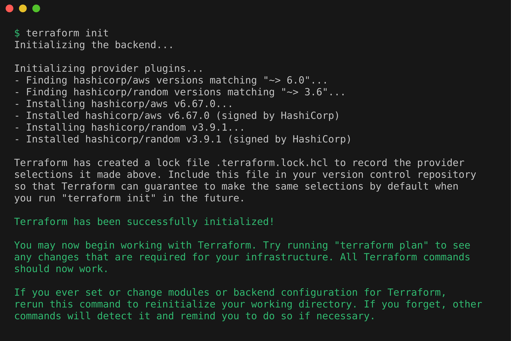
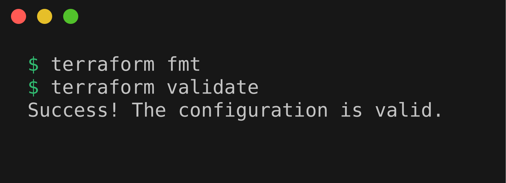

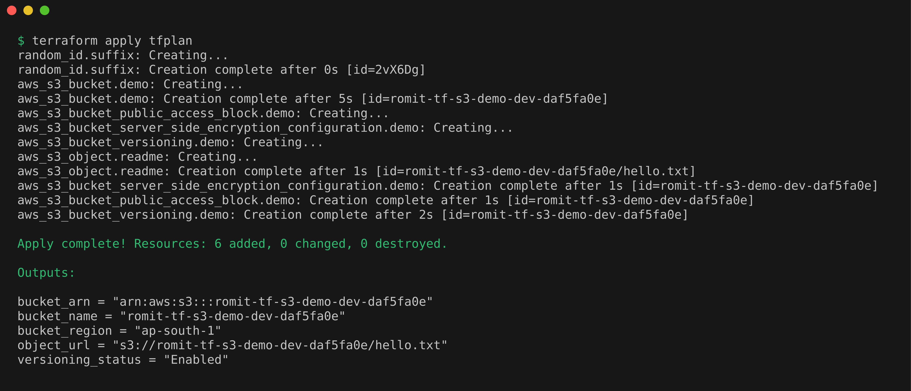
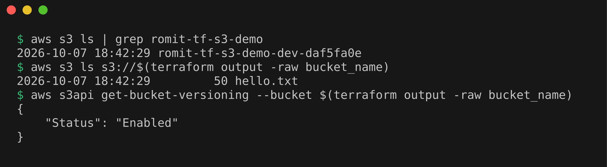
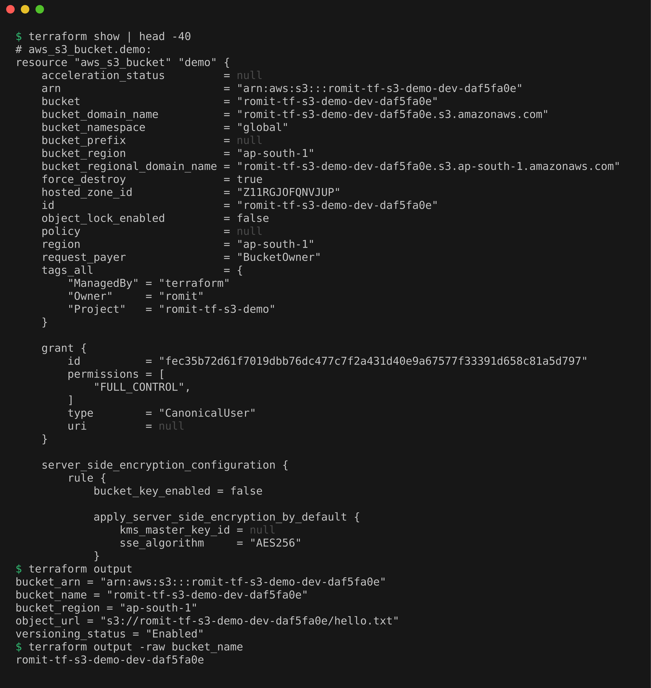


# Terraform S3 Demo

Creates one private, encrypted, versioned S3 bucket with a small test file in it, then destroys it.

## Files

`provider.tf` (providers, region, default tags), `variables.tf` and `terraform.tfvars` (inputs and their values), `main.tf` (bucket, versioning, encryption, public access block, one object) and `outputs.tf`. The bucket name gets a random suffix because S3 names are global.

## Prerequisites

`aws configure` stores the access key of an IAM user, and `get-caller-identity` confirms which user it is.

```bash
terraform version
aws --version
aws configure
aws sts get-caller-identity
```

## terraform init

```bash
terraform init
```

Downloaded the `aws` and `random` providers and wrote the lock file.



## terraform fmt and validate

```bash
terraform fmt
terraform validate
```

Nothing to reformat, and the configuration is valid.



## terraform plan

```bash
terraform plan -out=tfplan
```

A dry run: `Plan: 6 to add, 0 to change, 0 to destroy`, saved to `tfplan`.



## terraform apply

```bash
terraform apply tfplan
```

`Apply complete! Resources: 6 added`.



```bash
aws s3 ls | grep romit-tf-s3-demo
aws s3 ls s3://$(terraform output -raw bucket_name)
aws s3api get-bucket-versioning --bucket $(terraform output -raw bucket_name)
```

Checked with the AWS CLI: the bucket exists, holds `hello.txt`, and versioning is `Enabled`.



## terraform show and output

```bash
terraform show | head -40
terraform output
terraform output -raw bucket_name
```

`show` prints what is recorded in the state, and `output` prints the declared outputs.



## terraform destroy

```bash
terraform destroy -auto-approve
aws s3 ls | grep romit-tf-s3-demo
```

`Destroy complete! Resources: 6 destroyed`, and `aws s3 ls` finds no bucket.



## What Not to Commit

`.gitignore` excludes `.terraform/`, `tfplan` and `*.tfstate`, because state can contain sensitive values. The lock file `.terraform.lock.hcl` is committed.
