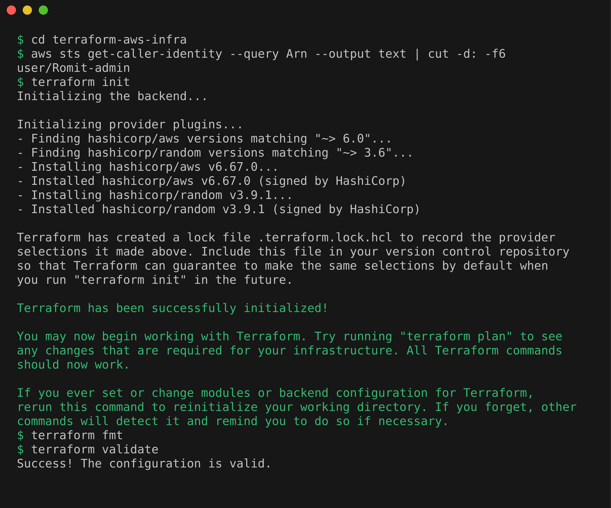
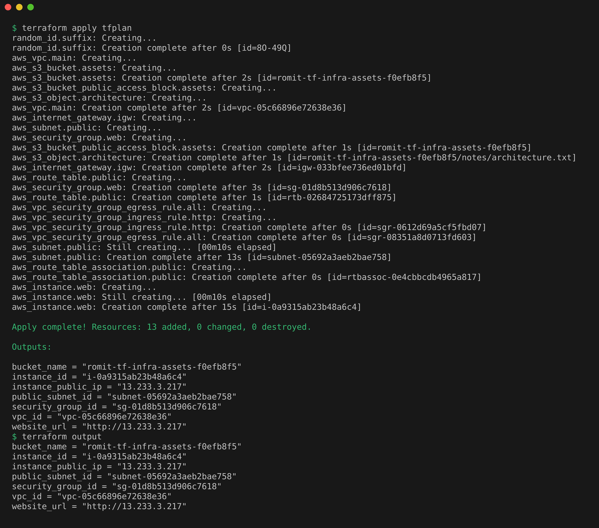
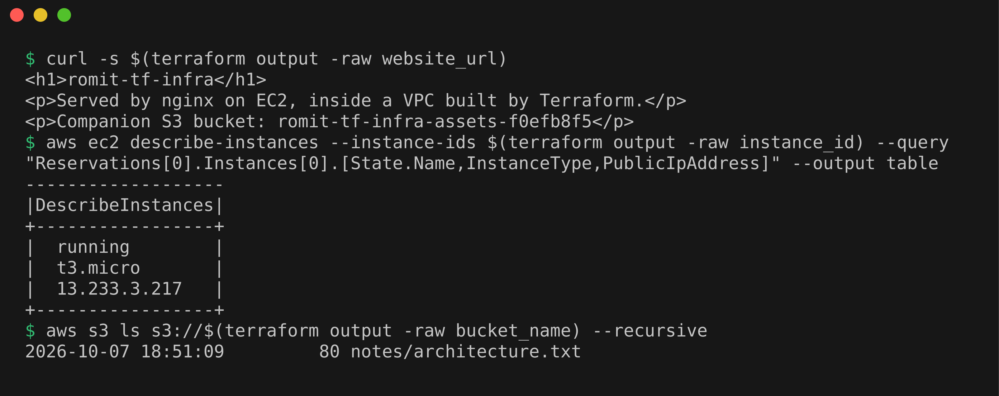
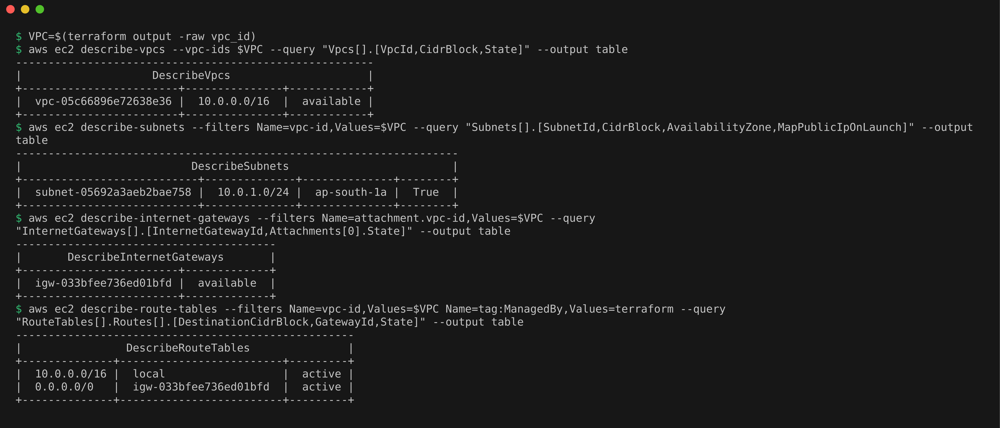
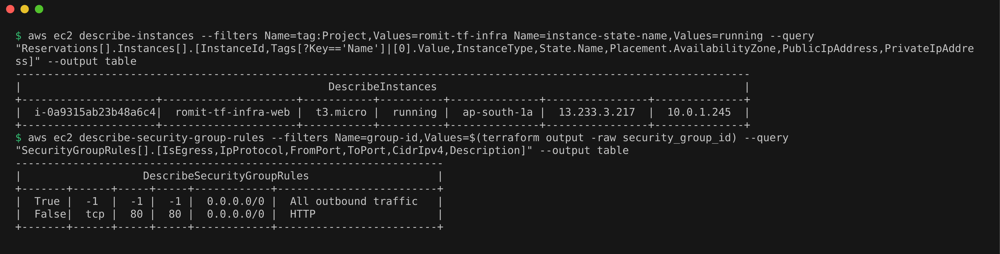
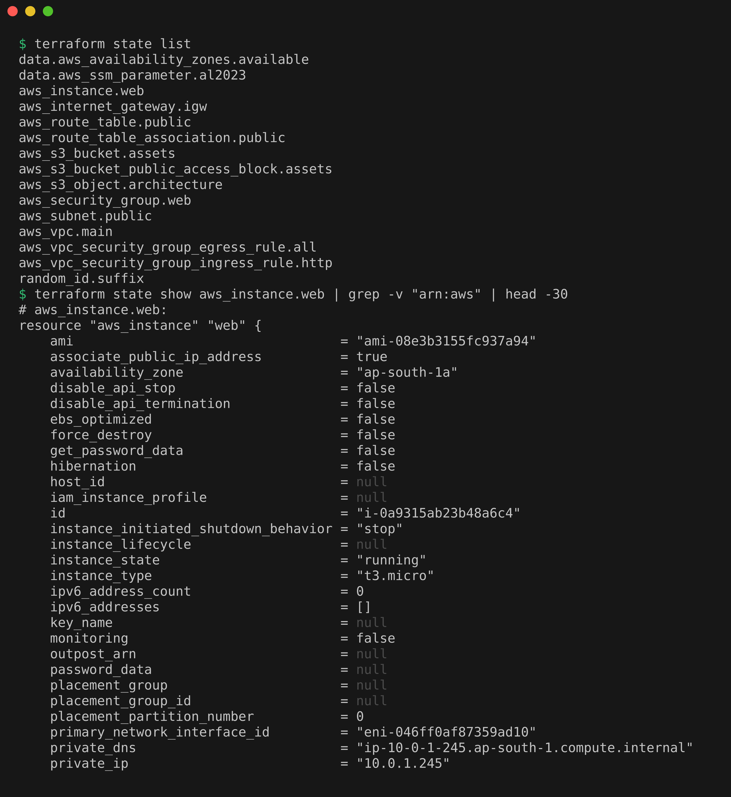
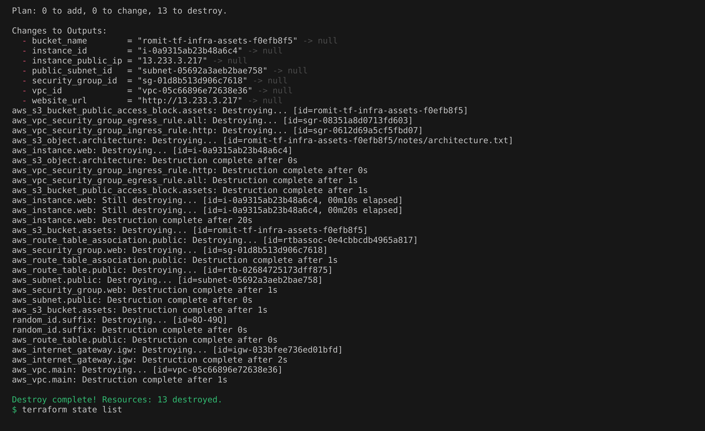

# Cloud & Terraform in Action Homework

## Project: Web Server in a Custom VPC, Built with Terraform

One `terraform apply` builds a VPC with a public subnet and an internet gateway, a security group, an EC2 instance serving an nginx page, and an S3 bucket, all in `ap-south-1`. One `terraform destroy` removes it all.

## Architecture

The same diagram is saved as [architecture.png](architecture.png).


## Project Files

`provider.tf`, `variables.tf` and `terraform.tfvars` for setup and inputs, `network.tf`, `security.tf`, `compute.tf` and `storage.tf` for the resources, `user_data.sh` for the nginx install on first boot, and `outputs.tf`.

## How Each Concept Shows Up

**Providers.** `hashicorp/aws` and `hashicorp/random`, pinned in `provider.tf`.

**Variables.** Declared in `variables.tf` and set in `terraform.tfvars`.

**Resources.** 13 managed resources across network, security, compute and storage.

**Data sources.** `aws_availability_zones` and an SSM parameter for the newest Amazon Linux 2023 AMI, read without creating anything.

**Outputs.** The website URL, public IP, bucket name and resource IDs.

**Dependencies.** Mostly implicit through references, plus one explicit `depends_on` so the instance waits for the route to the internet.

**Terraform state.** `terraform.tfstate` maps the code to real AWS IDs. It is not committed.

## Terraform Commands

### init, fmt, validate

```bash
cd terraform-aws-infra
aws sts get-caller-identity --query Arn --output text | cut -d: -f6
terraform init
terraform fmt
terraform validate
```

Identity confirmed, providers installed, and the configuration is valid.



### plan

```bash
terraform plan -out=tfplan
```

`Plan: 13 to add, 0 to change, 0 to destroy`, saved to `tfplan`.


### apply

```bash
terraform apply tfplan
terraform output
```

`Apply complete! Resources: 13 added`, with the outputs.



### Verify the AWS resources

```bash
curl -s $(terraform output -raw website_url)
aws ec2 describe-instances --instance-ids $(terraform output -raw instance_id) --query "Reservations[0].Instances[0].[State.Name,InstanceType,PublicIpAddress]" --output table
aws s3 ls s3://$(terraform output -raw bucket_name) --recursive
```

The nginx page answered, the instance is running, and the bucket holds its file.



```bash
VPC=$(terraform output -raw vpc_id)
aws ec2 describe-vpcs --vpc-ids $VPC --query "Vpcs[].[VpcId,CidrBlock,State]" --output table
aws ec2 describe-subnets --filters Name=vpc-id,Values=$VPC --query "Subnets[].[SubnetId,CidrBlock,AvailabilityZone,MapPublicIpOnLaunch]" --output table
aws ec2 describe-internet-gateways --filters Name=attachment.vpc-id,Values=$VPC --query "InternetGateways[].[InternetGatewayId,Attachments[0].State]" --output table
aws ec2 describe-route-tables --filters Name=vpc-id,Values=$VPC Name=tag:ManagedBy,Values=terraform --query "RouteTables[].Routes[].[DestinationCidrBlock,GatewayId,State]" --output table
```

The VPC, subnet, internet gateway and route table, listed with the AWS CLI instead of the console.



```bash
aws ec2 describe-instances --filters Name=tag:Project,Values=romit-tf-infra Name=instance-state-name,Values=running --query "Reservations[].Instances[].[InstanceId,Tags[?Key=='Name']|[0].Value,InstanceType,State.Name,Placement.AvailabilityZone,PublicIpAddress,PrivateIpAddress]" --output table
aws ec2 describe-security-group-rules --filters Name=group-id,Values=$(terraform output -raw security_group_id) --query "SecurityGroupRules[].[IsEgress,IpProtocol,FromPort,ToPort,CidrIpv4,Description]" --output table
```

The EC2 instance and its two security group rules.



### state

```bash
terraform state list
terraform state show aws_instance.web | grep -v "arn:aws" | head -30
```

The 13 resources and 2 data sources in the state, and the recorded instance details.



### destroy

```bash
terraform destroy -auto-approve
terraform state list
```

`Destroy complete! Resources: 13 destroyed`, and the state is empty.



## Cost Notes

`t3.micro` is Free Tier eligible, and the public IPv4 address is billed while it exists, so I destroyed everything right after the screenshots.
