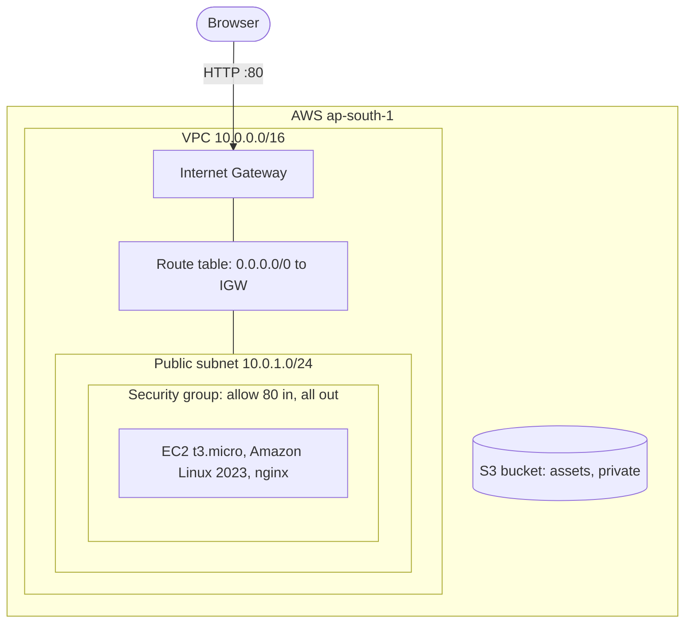

# Cloud & Terraform in Action Homework

## Project: Web Server in a Custom VPC, Built with Terraform

One `terraform apply` builds a small but complete AWS setup in `ap-south-1` (Mumbai): a VPC with a public subnet and internet access, a security group, an EC2 instance that installs nginx on first boot and serves a web page, and an S3 bucket. One `terraform destroy` removes all of it.

## Architecture



GitHub renders the diagram above from the `mermaid` code block. The same diagram is also saved as [architecture.png](architecture.png).

## Project Files

```text
terraform-aws-infra/
├── provider.tf        Terraform and provider versions, region, default tags
├── variables.tf       region, names, CIDR ranges, instance type, allowed HTTP source
├── terraform.tfvars   values for those variables
├── network.tf         VPC, public subnet, internet gateway, route table + association
├── security.tf        security group with HTTP ingress and egress rules
├── compute.tf         AMI lookup and the EC2 instance
├── storage.tf         S3 bucket, public access block, one object
├── user_data.sh       first boot script: install and start nginx
└── outputs.tf         IDs, public IP, website URL, bucket name
```

## How Each Concept Shows Up

**Providers.** `provider.tf` pins `hashicorp/aws ~> 6.0` and `hashicorp/random ~> 3.6`. A provider is the plugin that turns Terraform resources into API calls.

**Variables.** `variables.tf` declares inputs with types, descriptions and defaults. `terraform.tfvars` sets them, so the same code could build a second copy with different CIDRs or names.

**Resources.** 13 managed resources across network, security, compute and storage.

**Data sources.** `aws_availability_zones` and `aws_ssm_parameter` read existing information from AWS without creating anything. The SSM parameter always points to the newest Amazon Linux 2023 AMI, so no AMI ID is hardcoded.

**Outputs.** `outputs.tf` prints the website URL, public IP and IDs after apply.

**Dependencies.** Most are implicit: the subnet references `aws_vpc.main.id`, so Terraform knows the VPC must exist first. One is explicit: the instance has `depends_on = [aws_route_table_association.public]`, because its boot script needs internet access to install nginx, yet nothing in the instance block references the route table.

**Terraform state.** `terraform.tfstate` is Terraform's record mapping each resource in the code to a real AWS ID. That is how `plan` knows what already exists and `destroy` knows what to delete. It is in `.gitignore` because it can contain sensitive data.

## Terraform Commands

### init, fmt, validate

```bash
cd terraform-aws-infra
aws sts get-caller-identity --query Arn --output text | cut -d: -f6
terraform init
terraform fmt
terraform validate
```

The identity check shows which IAM user the credentials belong to (I cut the ARN down to the user part so my AWS account ID is not in the screenshot). `init` installed the `aws` v6.67.0 and `random` v3.9.1 providers, `fmt` changed nothing, and `validate` reported the configuration as valid.


### plan

```bash
terraform plan -out=tfplan
```

`Plan: 13 to add, 0 to change, 0 to destroy`. Saving the plan with `-out` guarantees that apply does exactly what was reviewed. The screenshot is very long because the plan lists every attribute of all 13 resources, and the summary line is at the bottom.


### apply

```bash
terraform apply tfplan
terraform output
```

`Apply complete! Resources: 13 added`, in about 35 seconds. The order in the apply log follows the dependency graph: VPC first (with the bucket in parallel, since it depends on nothing in the network), then subnet, gateway and security group, then route table and association, and the instance last.


### Verify the AWS resources

```bash
curl -s $(terraform output -raw website_url)
aws ec2 describe-instances --instance-ids $(terraform output -raw instance_id) --query "Reservations[0].Instances[0].[State.Name,InstanceType,PublicIpAddress]" --output table
aws s3 ls s3://$(terraform output -raw bucket_name) --recursive
```

nginx was answering about 20 seconds after apply finished. The curl returned the page with the project name and bucket name, the instance was `running` as a `t3.micro` with a public IP, and the bucket held `notes/architecture.txt`.


The AWS console needs a login, so instead of console screenshots I listed the same resources with `aws ec2 describe-...` commands. First the network side: the VPC, the public subnet, the internet gateway, and the route table with its `0.0.0.0/0` route to the gateway.

```bash
VPC=$(terraform output -raw vpc_id)
aws ec2 describe-vpcs --vpc-ids $VPC --query "Vpcs[].[VpcId,CidrBlock,State]" --output table
aws ec2 describe-subnets --filters Name=vpc-id,Values=$VPC --query "Subnets[].[SubnetId,CidrBlock,AvailabilityZone,MapPublicIpOnLaunch]" --output table
aws ec2 describe-internet-gateways --filters Name=attachment.vpc-id,Values=$VPC --query "InternetGateways[].[InternetGatewayId,Attachments[0].State]" --output table
aws ec2 describe-route-tables --filters Name=vpc-id,Values=$VPC Name=tag:ManagedBy,Values=terraform --query "RouteTables[].Routes[].[DestinationCidrBlock,GatewayId,State]" --output table
```


Then the compute side: the instance `romit-tf-infra-web` running in `ap-south-1a`, and the two security group rules (HTTP on port 80 in, everything out).

```bash
aws ec2 describe-instances --filters Name=tag:Project,Values=romit-tf-infra Name=instance-state-name,Values=running --query "Reservations[].Instances[].[InstanceId,Tags[?Key=='Name']|[0].Value,InstanceType,State.Name,Placement.AvailabilityZone,PublicIpAddress,PrivateIpAddress]" --output table
aws ec2 describe-security-group-rules --filters Name=group-id,Values=$(terraform output -raw security_group_id) --query "SecurityGroupRules[].[IsEgress,IpProtocol,FromPort,ToPort,CidrIpv4,Description]" --output table
```


### state

```bash
terraform state list
terraform state show aws_instance.web | grep -v "arn:aws" | head -30
```

`state list` shows the 13 managed resources plus the 2 data sources. `state show` prints everything Terraform recorded about one resource. I filtered out the ARN lines because they contain my AWS account ID.


### destroy

```bash
terraform destroy -auto-approve
terraform state list
```

All 13 resources destroyed in reverse dependency order (instance before subnet, VPC last), and `state list` printed nothing afterwards. The data sources were only read, so there is nothing to destroy for them. `-auto-approve` skips the `yes` prompt. The screenshot starts at the `13 to destroy` summary line, because everything above it is a very long list of every attribute being removed.


## Cost Notes

`t3.micro` is Free Tier eligible, and the bucket holds one tiny file. AWS charges for every public IPv4 address while it exists, so destroying right after taking screenshots keeps the cost close to zero. Here the instance existed for about two minutes.
