# Task 1

## Link creation
### Notice `hardlink.txt` and `original.txt` share the same inode number
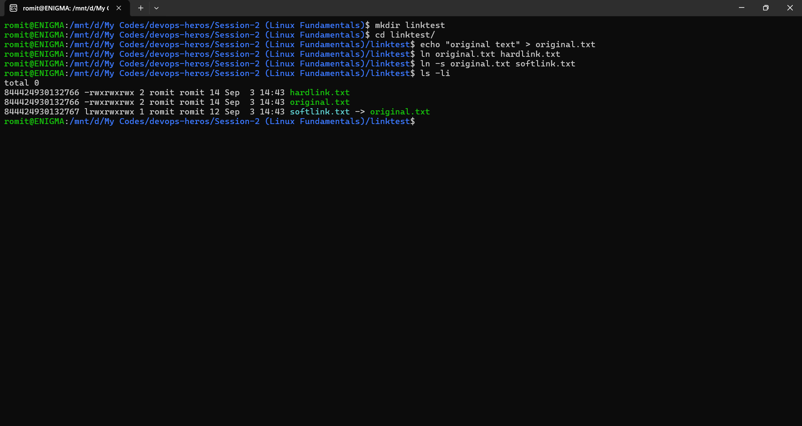

## Link test
### `original.txt` is deleted. `hardlink.txt` still works since it points to the same inode, but `softlink.txt` breaks since it only stored a path.
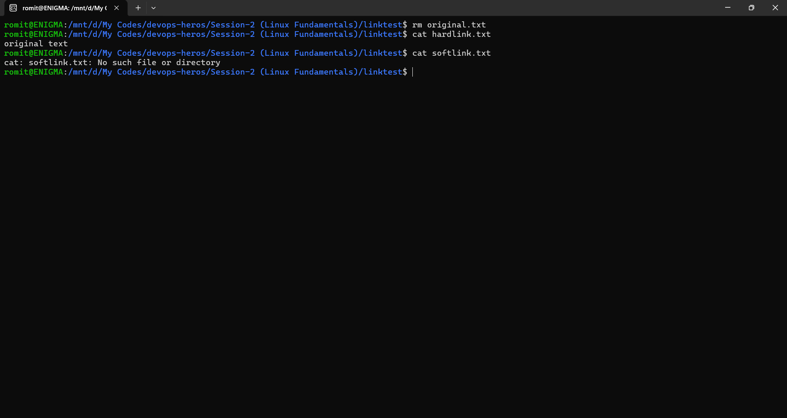

# Task 2

## `adduser`
### `adduser` is interactive and creates the home directory and password automatically.
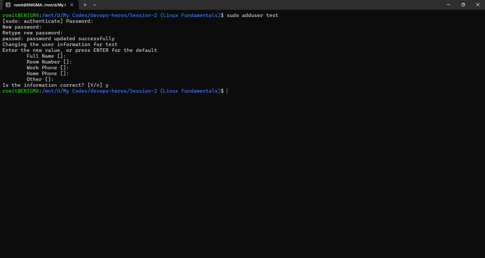

## `useradd`
### `useradd -m -s /bin/bash` does the same job but silently and without prompts. Common in scripts since it needs no manual input.
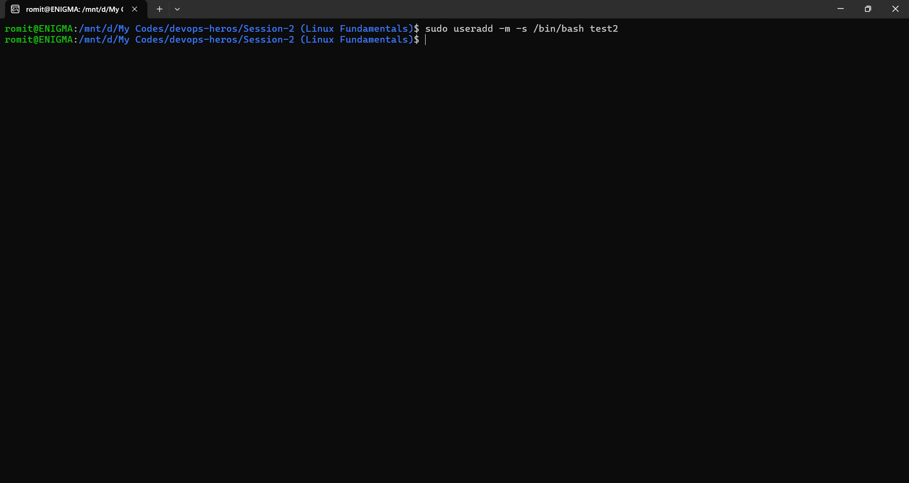

## test users verification
### Both users now exist with home directories, confirming both commands worked as expected.
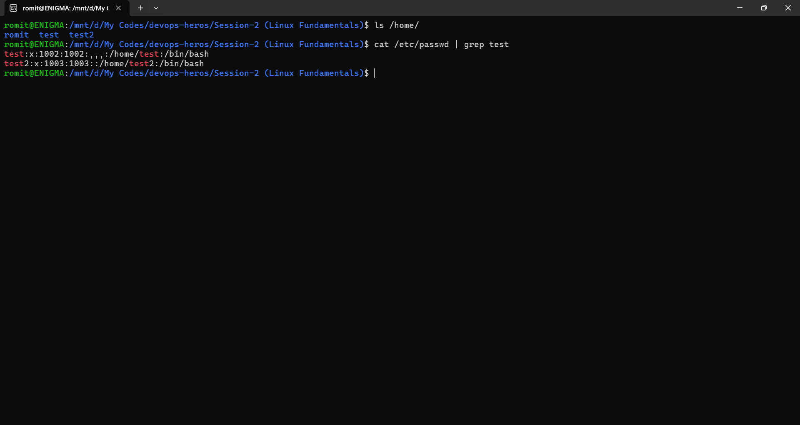

# Task 3

## `journalctl`
### Shows the full system journal collected by systemd, oldest entries first.
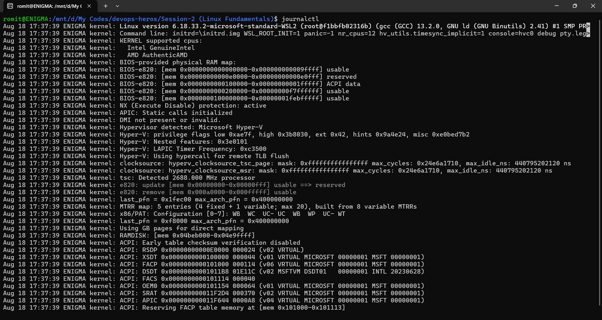

## `journalctl -u dbus`
### Filters logs down to one specific service (in this case `dbus`), useful for debugging a single failing service instead of reading everything.
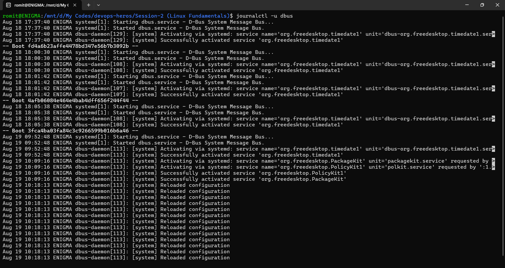

## `journalctl -p err`
### Filters by priority, here only errors. Useful when a service has thousands of routine lines and you just want the failures.
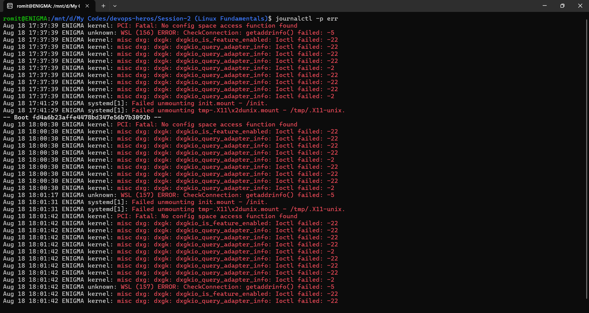

# Task 4

## Linux Command Cheat Sheet
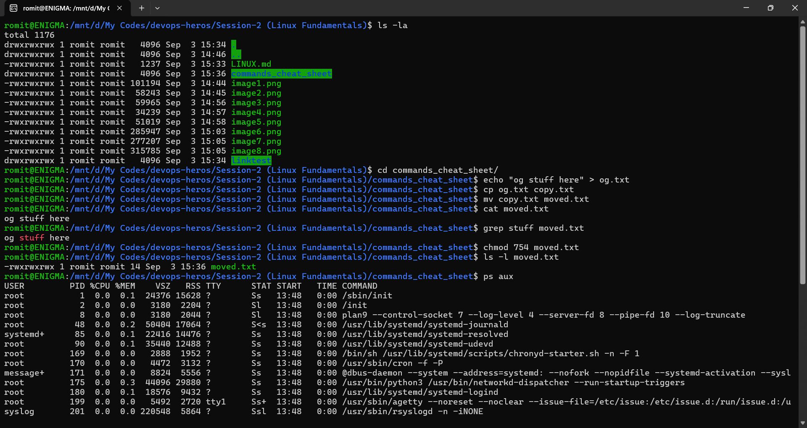
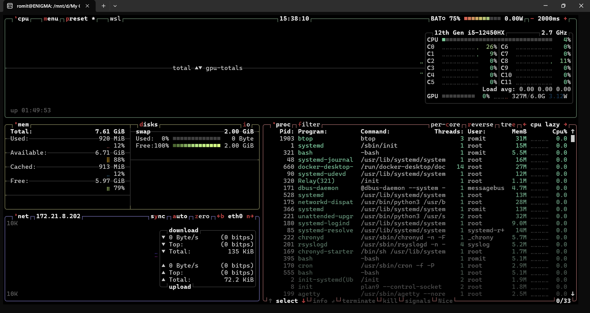
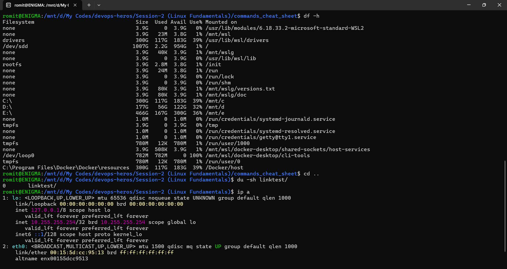
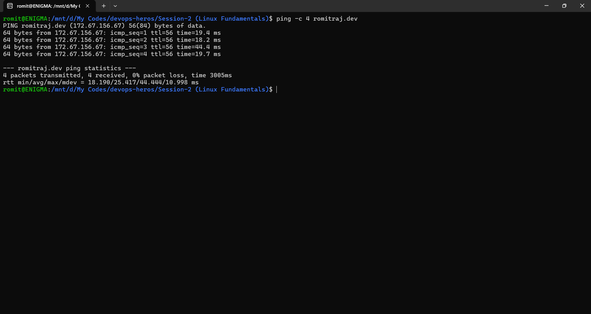