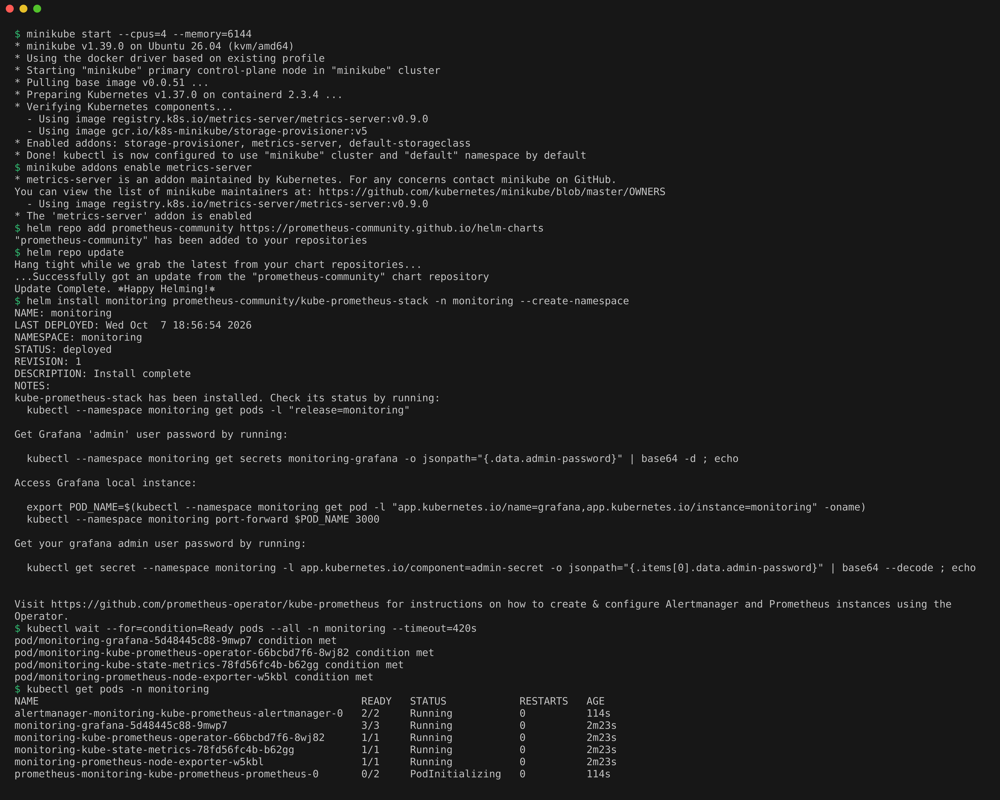
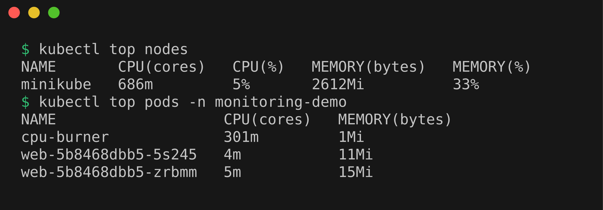
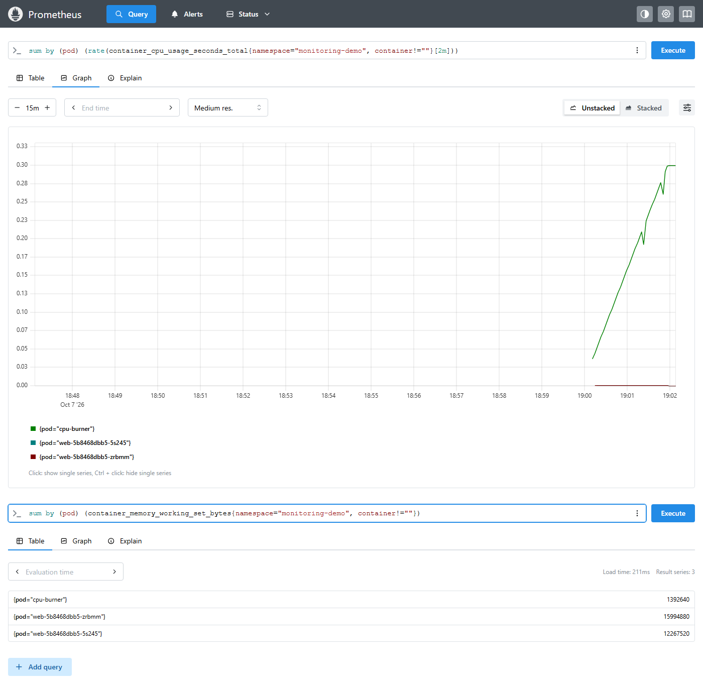
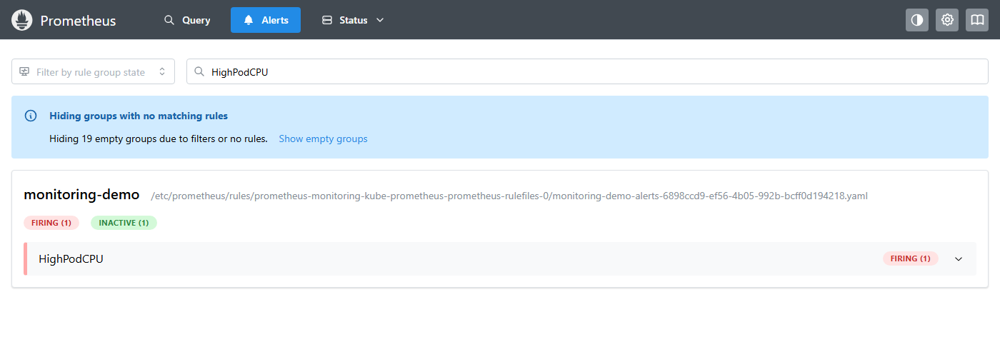
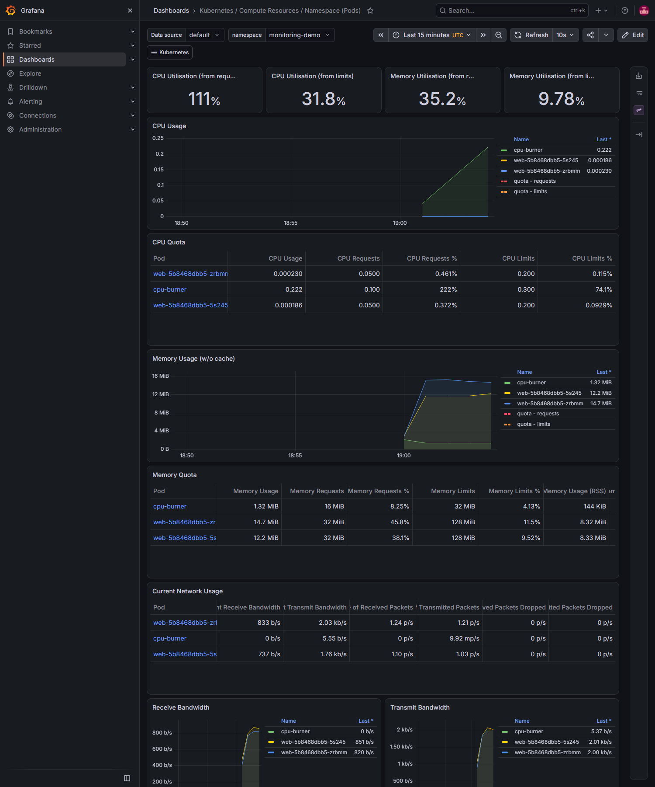
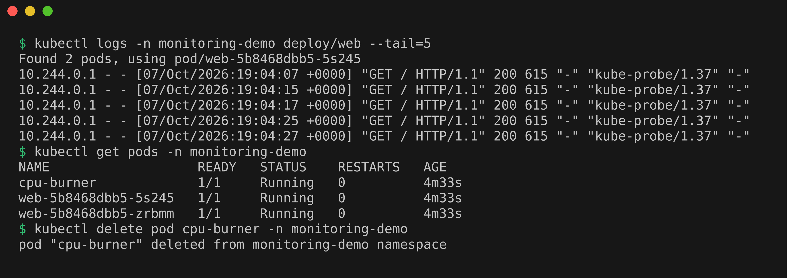

# Monitoring Demo: Prometheus, Grafana and Alerts on Minikube

Monitoring means continuously collecting numbers and events about a system and raising an alarm when something crosses a line. This demo installs the standard Kubernetes monitoring stack and uses it to show metrics, logs, alerts, CPU, memory and application health.

**kube-prometheus-stack** is a Helm chart that installs everything together:
- **Prometheus**, which scrapes (pulls) metrics from targets every few seconds and stores them as time series.
- **Grafana**, which draws dashboards from those metrics.
- **Alertmanager**, which receives fired alerts and routes them (email, Slack and so on).
- **node-exporter** (machine metrics) and **kube-state-metrics** (object state such as "is this pod ready").
- The **Prometheus Operator**, which lets alert rules be written as Kubernetes objects (`PrometheusRule`).

## Install the stack

```bash
minikube start --cpus=4 --memory=6144
minikube addons enable metrics-server
helm repo add prometheus-community https://prometheus-community.github.io/helm-charts
helm repo update
helm install monitoring prometheus-community/kube-prometheus-stack -n monitoring --create-namespace
kubectl wait --for=condition=Ready pods --all -n monitoring --timeout=420s
kubectl get pods -n monitoring
```

Minikube was already running, so `minikube start` only confirmed the existing cluster. About two and a half minutes after the install, Grafana, Alertmanager, the operator, kube-state-metrics and node-exporter were `Running`. The Prometheus pod itself was still in `PodInitializing` in the screenshot (it is created by the operator a bit later, so `kubectl wait` did not know about it yet) and went to `2/2 Running` shortly after.



## Deploy the demo app and alert rules

```bash
kubectl apply -f demo-app.yaml
kubectl apply -f alert-rules.yaml
kubectl get pods -n monitoring-demo
kubectl get prometheusrule -n monitoring demo-alerts
```

`demo-app.yaml` has an nginx Deployment with probes and a `cpu-burner` pod that spins in an endless loop. `alert-rules.yaml` defines two alerts:
- `HighPodCPU` fires when a pod in `monitoring-demo` uses more than 0.2 CPU cores for 1 minute.
- `PodNotReady` fires when a pod has been not ready for 1 minute.

The `release: monitoring` label matters, because the stack only loads rules that carry its release name.

## CPU and memory utilization

```bash
kubectl top nodes
kubectl top pods -n monitoring-demo
```

The burner sits at 301m CPU, right at its 300m limit, while the two nginx pods use 4m and 5m. The node as a whole was at 686m CPU and 2612Mi of memory (33%).



## Metrics in Prometheus

```bash
kubectl port-forward -n monitoring svc/monitoring-kube-prometheus-prometheus 9090:9090
```

Opened `http://localhost:9090` and ran these two queries on the Query page (this Prometheus is v3.15, where the old Graph page is called Query):

```text
sum by (pod) (rate(container_cpu_usage_seconds_total{namespace="monitoring-demo", container!=""}[2m]))
sum by (pod) (container_memory_working_set_bytes{namespace="monitoring-demo", container!=""})
```

The first is CPU cores used per pod, shown as a graph. The `cpu-burner` line climbs to 0.30 while the nginx pods stay flat at the bottom. (It climbs gradually because `rate(...[2m])` needs two minutes of samples before it shows the full value.) The second is memory in use per pod, shown as a table: about 1.4 MB for the burner and 12 to 16 MB for each nginx pod.



## Alerts

About three minutes after the burner started, Prometheus' Alerts page showed `HighPodCPU` as **Firing** for `cpu-burner`. Before that it was **Pending**, which means the condition is true but has not lasted the full `for: 1m` yet. `PodNotReady` stayed inactive the whole time, because every pod was ready. The screenshot is the Alerts page filtered to `HighPodCPU`.



## Grafana dashboards

```bash
kubectl get secret -n monitoring monitoring-grafana -o jsonpath="{.data.admin-password}" | base64 -d; echo
kubectl port-forward -n monitoring svc/monitoring-grafana 3000:80
```

Logged in at `http://localhost:3000` as `admin` with that password, then opened **Dashboards, Kubernetes / Compute Resources / Namespace (Pods)** and picked `monitoring-demo` with the time range set to the last 15 minutes. It shows CPU and memory per pod over time. In the CPU Quota table the burner is at 222% of its 100m request and 74% of its 300m limit.



## Logs and application health

```bash
kubectl logs -n monitoring-demo deploy/web --tail=5
kubectl get pods -n monitoring-demo
kubectl delete pod cpu-burner -n monitoring-demo
```

Logs are the event side of monitoring: nginx writes one access log line per request, including every probe check from the kubelet. Health comes from the readiness and liveness probes. A pod is only `READY 1/1` while its readiness probe passes, and kube-state-metrics turns that into the `kube_pod_status_ready` metric that the `PodNotReady` alert watches. All three pods were `1/1 Running` with 0 restarts. After I deleted the burner, `HighPodCPU` disappeared from the active alerts about a minute later, without me touching Prometheus.



## Cleanup

```bash
kubectl delete -f demo-app.yaml -f alert-rules.yaml --ignore-not-found
helm uninstall monitoring -n monitoring
kubectl delete namespace monitoring
```
