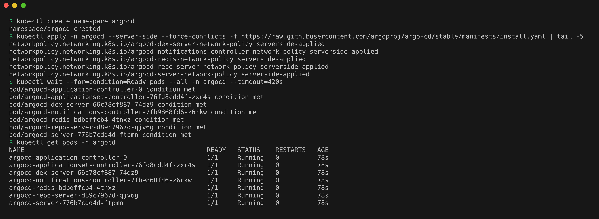
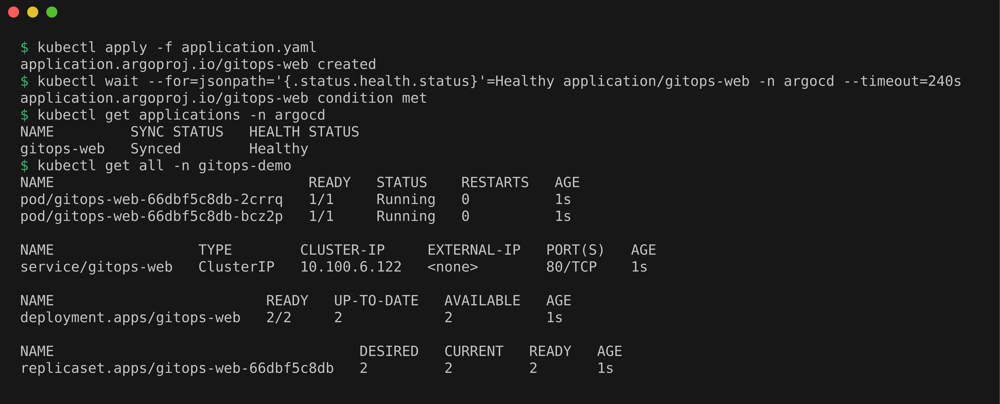
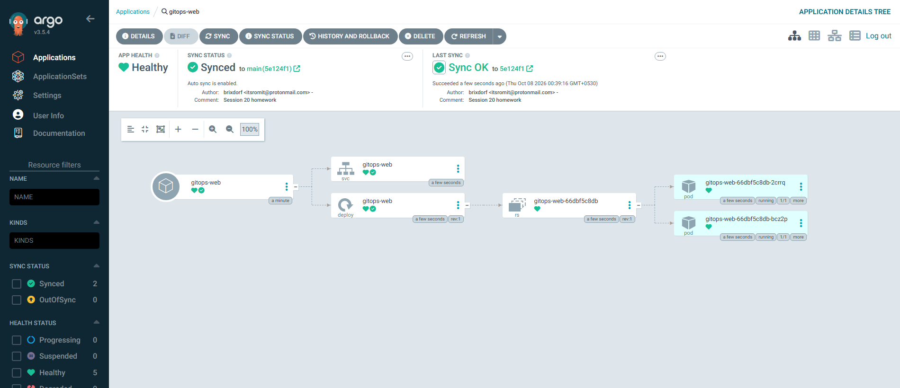
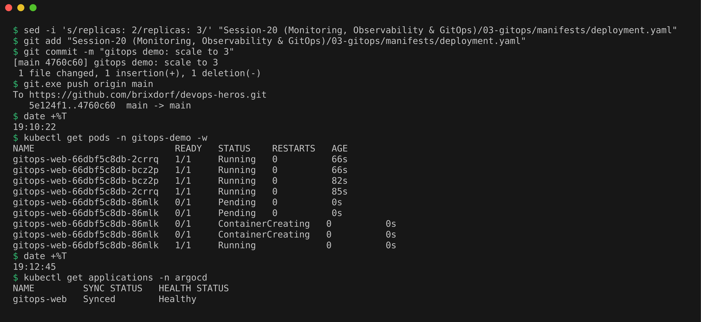
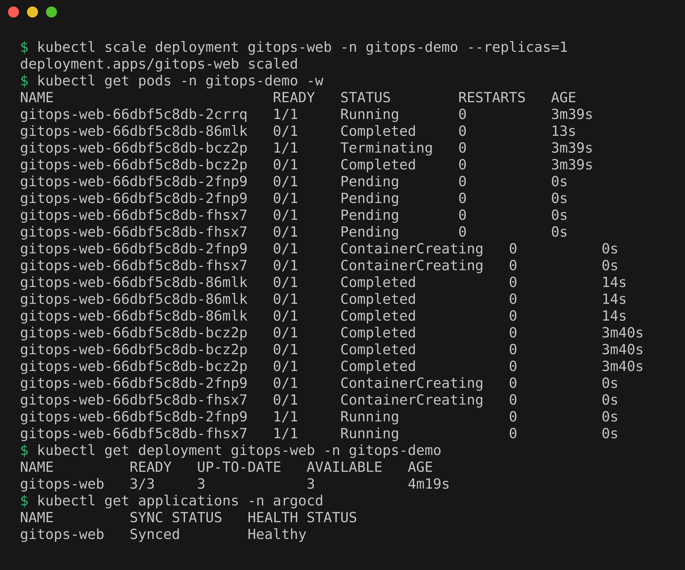

# GitOps

## What is GitOps

**GitOps** is a way of deploying and running applications where a Git repository holds the full description of how the system should look, and an automated tool keeps the real system matching that description.

Without GitOps, a typical deploy looks like this: someone (or a CI job) runs `kubectl apply` or `helm upgrade` against the cluster. After a few months nobody is fully sure what is running, because people ran commands by hand, hotfixed things in the cluster, and forgot to update the repo.

With GitOps, the rule is simple: **if you want to change the cluster, you change Git.** A tool watching the repo does the rest.

The OpenGitOps project (part of the CNCF, the Cloud Native Computing Foundation) defines four principles:

1. **Declarative**: the desired state is written down as a description, not as steps.
2. **Versioned and immutable**: that description is stored with full history, so old versions cannot be silently changed.
3. **Pulled automatically**: software agents pull the desired state from the source by themselves.
4. **Continuously reconciled**: the agents keep comparing the real state with the desired state and fix any difference.

The sections below go through these ideas one by one.

## Git as the source of truth

**Source of truth** means the one place everyone agrees is correct. In GitOps that place is a Git repo, not the cluster and not someone's laptop.

Using Git for this gives a lot for free:

- **History and audit:** every change is a commit with an author, a time and a message. `git log` tells you who changed the replica count and when.
- **Review:** changes go through pull requests, so a teammate can review a deploy just like code.
- **Easy rollback:** going back to the last working version is `git revert`. The tool then rolls the cluster back too.
- **Disaster recovery:** if the cluster dies, point a new cluster at the same repo and it rebuilds the same setup.

Many teams keep two repos: one for the app's source code, and a separate **config repo** (sometimes called the environment or manifests repo) that only holds Kubernetes YAML, Helm values or Kustomize files. CI builds the image and then updates the image tag in the config repo.

## Declarative configuration

**Declarative** means you describe *what* you want, not *how* to get there. The opposite is **imperative**, where you list the commands to run.

Imperative:

```bash
kubectl create deployment web --image=nginx:1.27
kubectl scale deployment web --replicas=3
```

Declarative:

```yaml
apiVersion: apps/v1
kind: Deployment
metadata:
  name: web
spec:
  replicas: 3
  selector:
    matchLabels:
      app: web
  template:
    metadata:
      labels:
        app: web
    spec:
      containers:
        - name: web
          image: nginx:1.27
```

The YAML file says "there should be 3 nginx Pods". It does not care whether there are 0 or 5 right now; Kubernetes figures out what to do. That is exactly what GitOps needs, because a file in Git can describe the end state, while a list of commands cannot easily be compared with a running cluster.

## Continuous reconciliation

**Reconciliation** means comparing the desired state (in Git) with the actual state (in the cluster) and fixing the difference. When the two differ, we say the cluster has **drift**.

A GitOps tool runs this as a loop, forever:

1. Read the manifests from Git.
2. Read the live objects from the cluster.
3. Compare them.
4. If they differ, apply the Git version.

Example: someone runs `kubectl scale deployment web --replicas=10` by hand to "quickly fix" a load problem. Git still says 3. On the next loop the tool notices the drift and, if self healing is enabled, scales it back to 3. The fix that sticks is a commit that changes Git.

This is the same idea Kubernetes controllers already use internally (a Deployment controller keeps the right number of Pods), just moved one level up: Git to cluster.

## GitOps workflow: push vs pull

There are two ways changes can reach the cluster.

### Push model

The CI/CD pipeline (for example GitHub Actions or Jenkins) runs `kubectl apply` or `helm upgrade` against the cluster at the end of the pipeline.

```
developer -> git push -> CI pipeline -> kubectl apply -> cluster
```

- Simple and familiar.
- The CI system needs cluster credentials (a kubeconfig stored as a secret outside the cluster), which is a security risk.
- It only deploys when the pipeline runs. If someone changes the cluster by hand, nothing notices or fixes it.

### Pull model

An agent runs **inside** the cluster and pulls changes from Git on its own.

```
developer -> git push -> config repo <- agent in cluster pulls -> applies to cluster
```

- No cluster credentials leave the cluster. The agent only needs read access to Git.
- The agent reconciles continuously, so drift is detected and fixed.
- It works for clusters behind firewalls, since the cluster makes outgoing connections only.

The pull model is what most people mean by "real" GitOps, and it matches the "pulled automatically" principle. CI still exists: it tests code, builds and pushes the image, and updates the tag in the config repo. It just stops talking to the cluster directly.

## Kubernetes + GitOps: Argo CD and Flux

The two main GitOps tools for Kubernetes are **Argo CD** and **Flux**. Both are pull based, both run as controllers inside the cluster, and both are CNCF graduated projects (they graduated in late 2022), which means they are considered mature and widely used.

### Argo CD

- You create an **Application** (a custom resource, meaning a new object type Argo CD adds to Kubernetes) that says: "take this path in this Git repo and deploy it to this namespace".
- Has a web UI that shows every resource as a tree and marks it **Synced** or **OutOfSync** with Git, plus a CLI (`argocd`).
- Supports plain YAML, Helm charts and Kustomize.
- By default it checks Git every three minutes; a Git webhook can trigger it right away.
- With an automated sync policy, `selfHeal` reverts manual changes and `prune` deletes resources that were removed from Git.

### Flux

- A set of small controllers (the "GitOps Toolkit"): source-controller fetches from Git, Helm or OCI repos, kustomize-controller and helm-controller apply what was fetched, notification-controller sends alerts and receives webhooks.
- Configured fully with Kubernetes objects such as `GitRepository` and `Kustomization`, each with its own sync `interval`.
- No built in web UI by default; it is mostly driven by the `flux` CLI and YAML.
- Can watch a container registry and automatically commit new image tags back to Git (image automation).

### Which one?

Both do the core job well. Argo CD is often picked when a team wants a visual dashboard and easy onboarding. Flux is often picked by teams that prefer everything as Kubernetes YAML and a lightweight, modular setup. For learning on Minikube, either one is fine.

## Hands-on Demo: Argo CD on Minikube

The app lives in this repo under `03-gitops/manifests/` (a Deployment that started with 2 replicas, and a Service). `application.yaml` tells Argo CD to keep the `gitops-demo` namespace identical to that folder on the `main` branch, with:
- `automated`, so it syncs by itself, with no manual click.
- `prune: true`, so files deleted from Git are deleted from the cluster.
- `selfHeal: true`, so manual changes in the cluster get reverted to match Git.

### Install Argo CD

```bash
kubectl create namespace argocd
kubectl apply -n argocd --server-side --force-conflicts -f https://raw.githubusercontent.com/argoproj/argo-cd/stable/manifests/install.yaml | tail -5
kubectl wait --for=condition=Ready pods --all -n argocd --timeout=420s
kubectl get pods -n argocd
```

`--server-side` is needed because some Argo CD CRDs are too large for a normal client-side apply. The apply prints one line per object, so I only kept the last 5. All 7 Argo CD pods were `1/1 Running` after 78 seconds.



### Create the Application

```bash
kubectl apply -f application.yaml
kubectl wait --for=jsonpath='{.status.health.status}'=Healthy application/gitops-web -n argocd --timeout=240s
kubectl get applications -n argocd
kubectl get all -n gitops-demo
```

Argo CD cloned the repo, created the namespace and deployed 2 pods. The application shows `Synced` and `Healthy`.



### Argo CD UI

```bash
kubectl -n argocd get secret argocd-initial-admin-secret -o jsonpath="{.data.password}" | base64 -d; echo
kubectl port-forward svc/argocd-server -n argocd 8080:443
```

Logged in at `https://localhost:8080` as `admin` (the browser warns about the self-signed certificate). This is Argo CD v3.5.4. The app is `Healthy` and `Synced to main`, with my last commit shown as the synced revision, and the tree shows the Service, the Deployment, its ReplicaSet and the 2 Pods.



### Change Git, watch the cluster follow

Changed `replicas: 2` to `replicas: 3` in `manifests/deployment.yaml`, then committed and pushed (run from the repo root):

```bash
sed -i 's/replicas: 2/replicas: 3/' "Session-20 (Monitoring, Observability & GitOps)/03-gitops/manifests/deployment.yaml"
git add "Session-20 (Monitoring, Observability & GitOps)/03-gitops/manifests/deployment.yaml"
git commit -m "gitops demo: scale to 3"
git.exe push origin main
date +%T
kubectl get pods -n gitops-demo -w
date +%T
kubectl get applications -n argocd
```

Argo CD checks Git every 3 minutes by default (Refresh in the UI checks right away). I did not click Refresh and just waited. The push finished at 19:10:22, and the third pod appeared about 2 minutes and 20 seconds later, without any `kubectl apply` from me. Git is the only place the change was made. (`git.exe` is the Windows Git, which is where my GitHub login is saved. It works on the same repo folder from WSL.)



### Self-healing

```bash
kubectl scale deployment gitops-web -n gitops-demo --replicas=1
kubectl get pods -n gitops-demo -w
kubectl get deployment gitops-web -n gitops-demo
kubectl get applications -n argocd
```

The manual change made the cluster drift away from Git. Two pods started terminating, and within about a second Argo CD had put the replica count back, so two new pods (`2fnp9` and `fhsx7`) were created to replace them. The deployment ended at `3/3` again and the application stayed `Synced` and `Healthy`.



### Cleanup

```bash
kubectl delete -f application.yaml
kubectl delete namespace gitops-demo argocd
```

