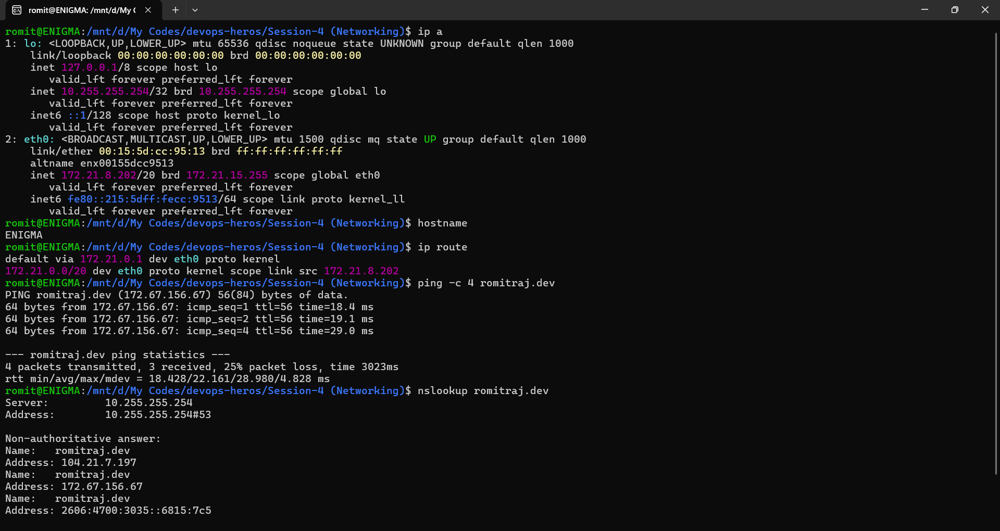
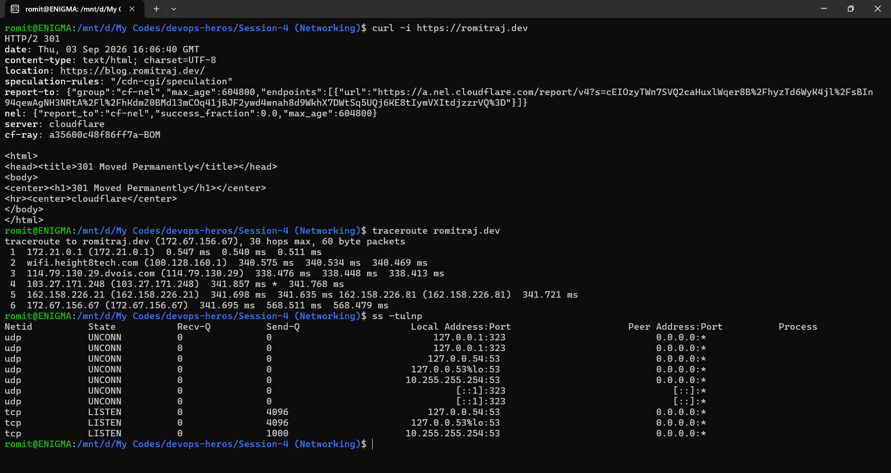
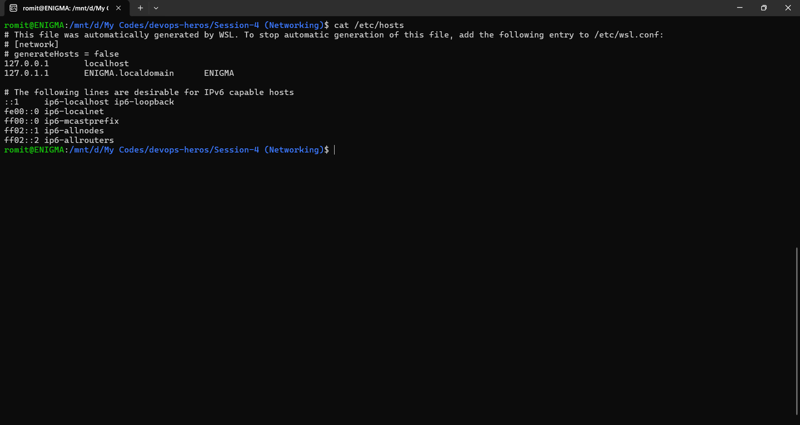

# Networking Commands

- `ip a` - shows this machine's IP addresses and network interfaces
- `hostname` - prints this machine's network name
- `ip route` - shows routing table, how this machine reaches other networks
- `ping -c 4 romitraj.dev` - sends 4 ICMP packets to check reachability and latency
- `nslookup romitraj.dev` - shows which DNS servers resolve romitraj.dev to an IP
- `curl -i https://romitraj.dev` - fetches page, shows response headers
- `traceroute romitraj.dev` - shows each network hop to romitraj.dev
- `ss -tulnp` - shows listening ports and processes using them
- `cat /etc/hosts` - shows local hostname-to-IP mappings

## Screenshots

