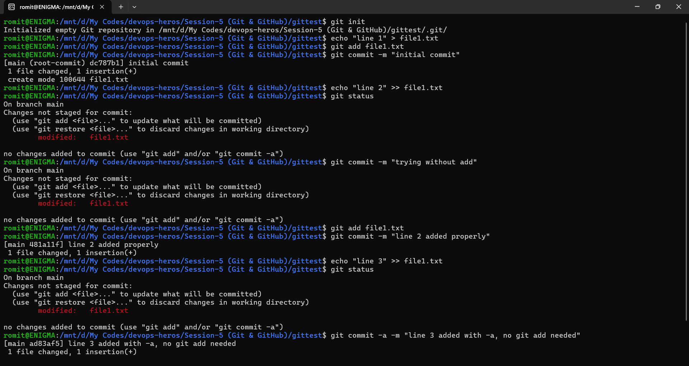
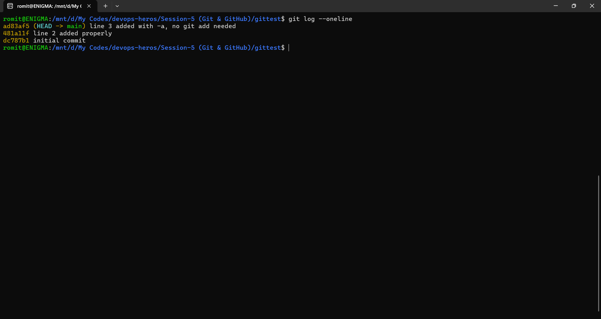
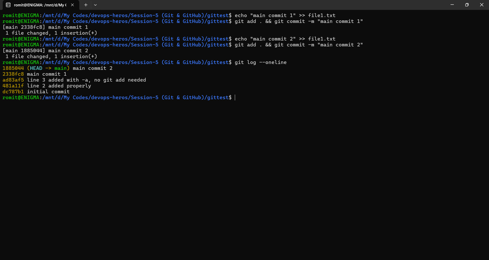
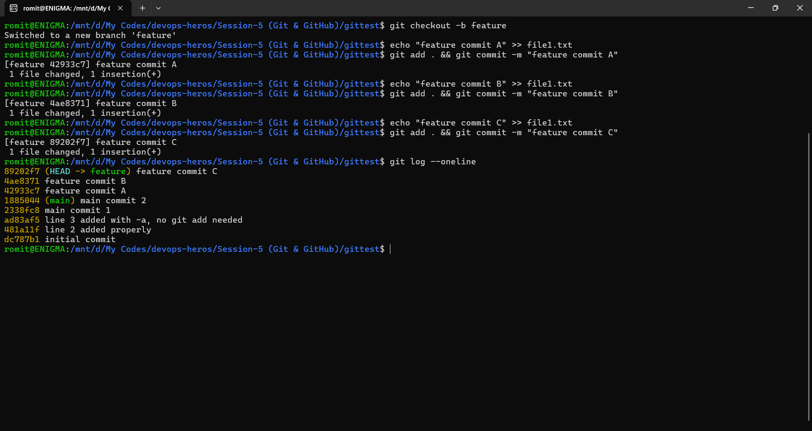
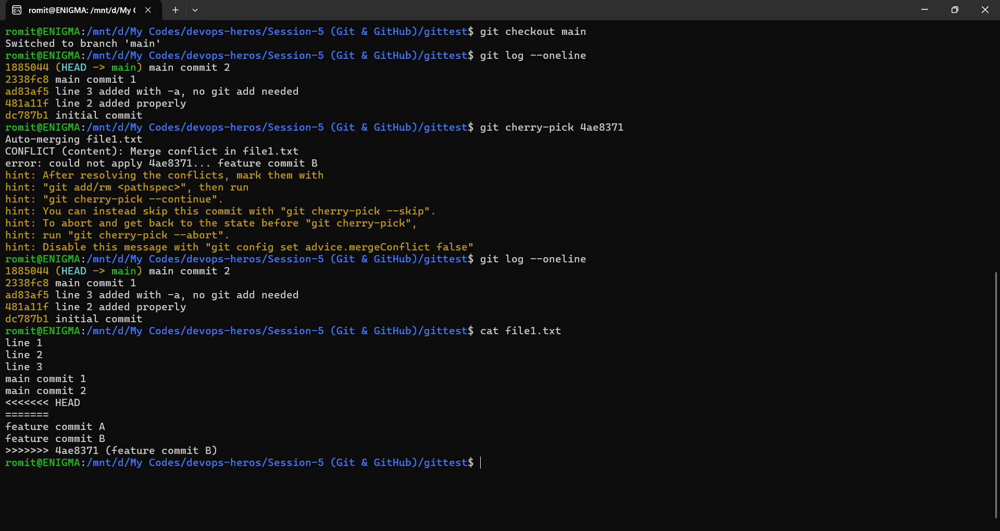

# Task 1

### `git commit -m` only commits staged changes. `git commit -a -m` auto-stages already-tracked modified files, skips the git add step. New untracked files still need git add either way.

# Task 2

### Created commits on main, branched off into feature, made 3 more commits there. Used git log to find one specific commit's ID, then cherry-picked just that commit onto main. Verified with git log and file content that only that one commit came over, not the whole branch.

