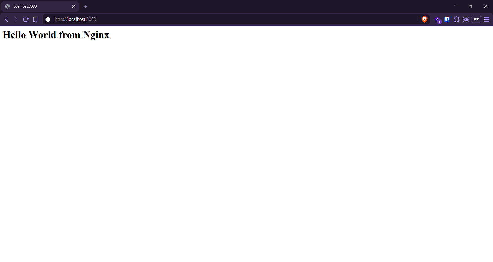
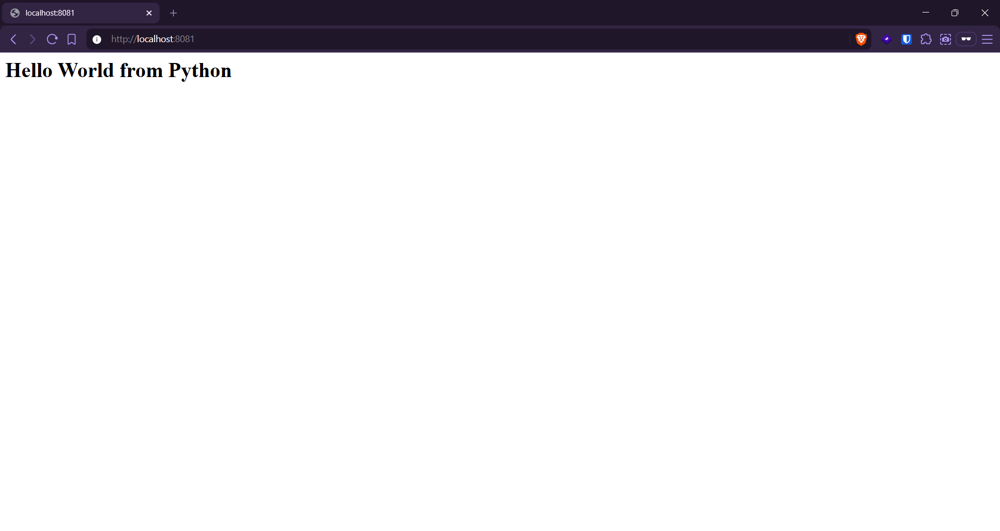
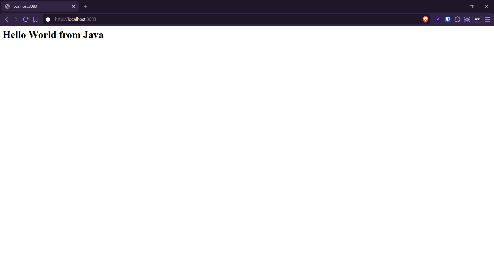
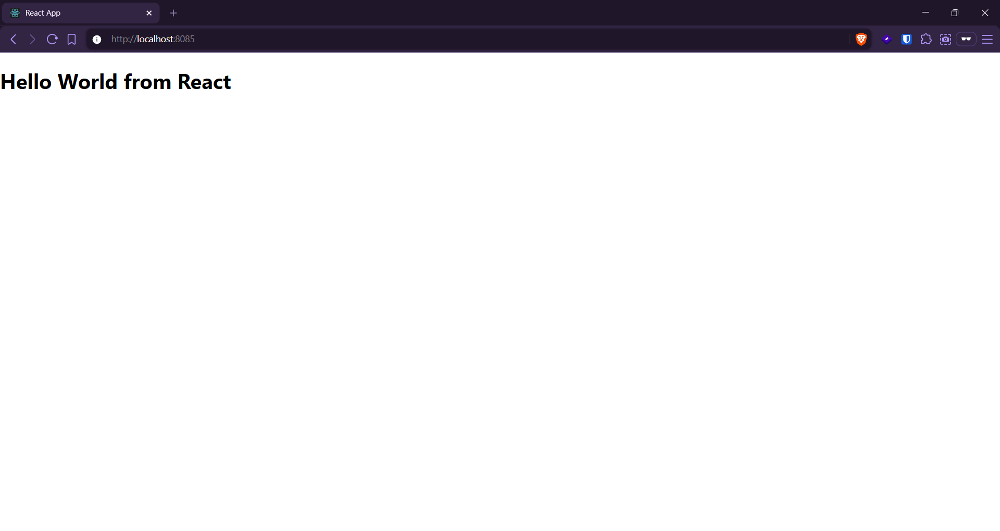

# Docker Homework: Hello World Applications

## Six Hello World apps, each in its own folder with a Dockerfile, built and run separately.

- **nginx-app** - static HTML served by Nginx
- **python-app** - Python built-in HTTP server
- **nodejs-app** - Node built-in HTTP server
- **java-app** - Java built-in HttpServer
- **apache-app** - static HTML served by Apache httpd
- **react-app** - React app, multi-stage build, served by Nginx

## Screenshots

