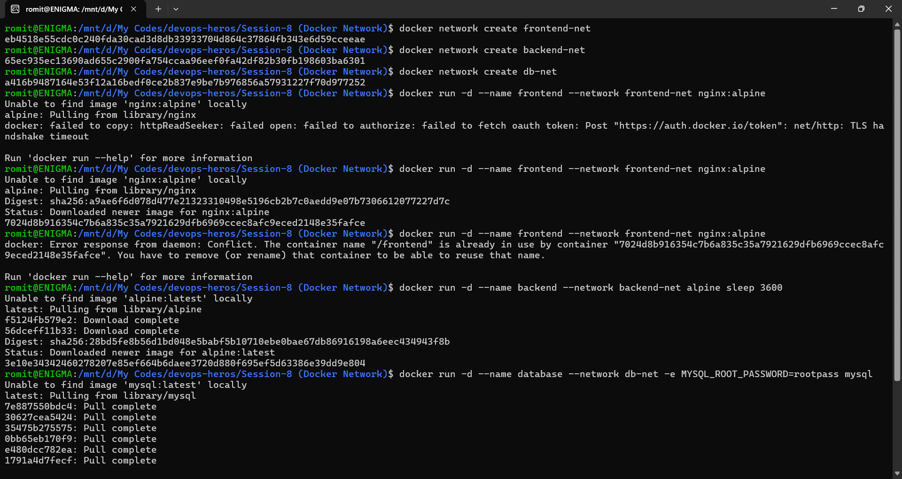
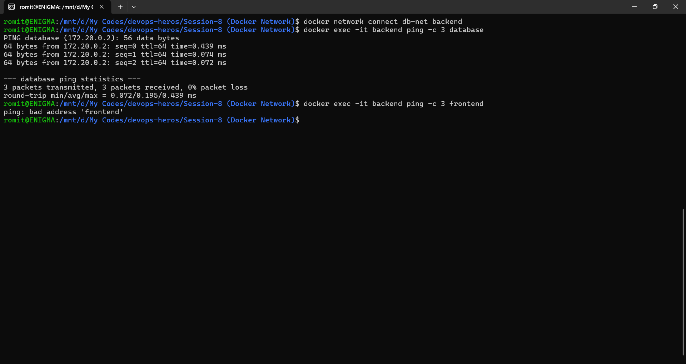
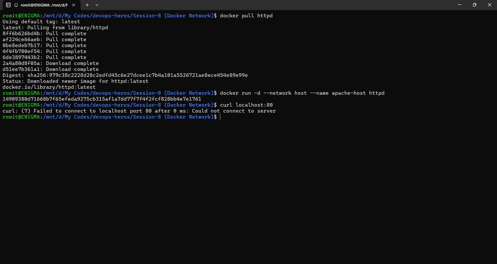
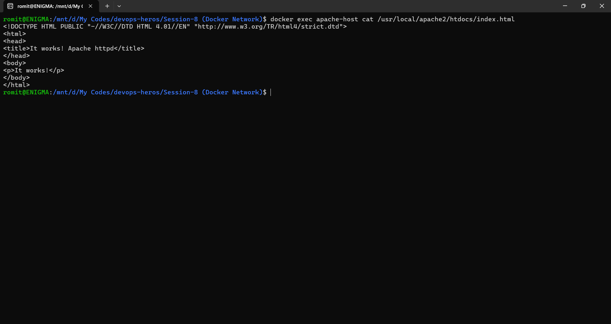
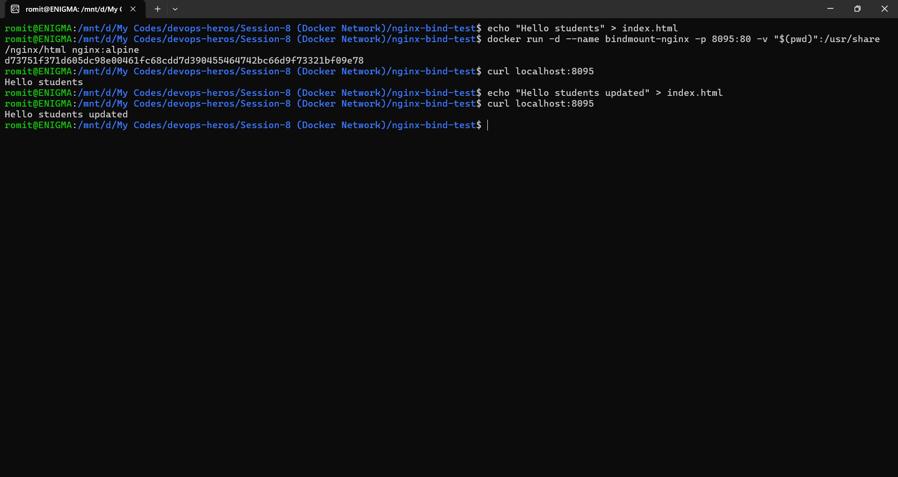

# Docker Networking & Volume Homework

## Task 1: Container Networking
Created 3 networks (frontend-net, backend-net, db-net) and 3 containers (frontend, backend, database). Backend connected to both backend-net and db-net. Ping from backend to database succeeded since they share db-net. Ping from backend to frontend failed since they don't share a network, proving network isolation.

## Task 2: Host Network
Pulled httpd (Apache) image, ran with --network host. No port mapping needed since host networking shares the machine's network directly. Verified on localhost:80.

## Task 3: Bind Mount
Created a local folder with index.html containing "Hello students". Bind mounted it into an Nginx container using -v. Verified content on the site, then edited the file locally and confirmed the change appeared immediately without restarting the container.

## Task 4: Overlay Network
Bridge networks (used in Task 1) only work between containers on one machine. Overlay networks extend that across multiple Docker hosts, letting containers on different physical machines talk to each other as if local. Used in Docker Swarm and Kubernetes clusters to let containers spread across multiple machines discover and communicate with each other.