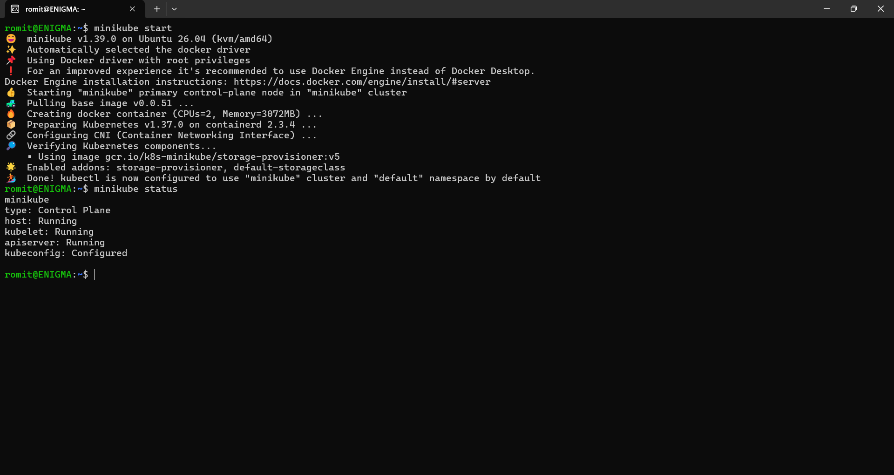

# Kubernetes Fundamentals Homework

## Task 1: Minikube Setup & Verification

Installed Minikube and verified the cluster is up and running.

```bash
curl -LO https://github.com/kubernetes/minikube/releases/latest/download/minikube-linux-amd64
sudo install minikube-linux-amd64 /usr/local/bin/minikube && rm minikube-linux-amd64

minikube start
minikube status
```



## Task 4: Kubernetes Component Summary

A quick rundown of the core components that make up a Kubernetes cluster.

**Control Plane:**
- **etcd**: key-value store, the single source of truth for all cluster state (Pods, nodes, configs, everything).
- **kube-apiserver**: the front door to the cluster, every request (from `kubectl`, from other components) passes through here first. No two components talk to each other directly.
- **kube-scheduler**: decides which node a newly created Pod should run on, based on available resources.
- **kube-controller-manager**: runs multiple controllers (ReplicaSet controller, Node controller, etc.) that continuously reconcile actual cluster state toward desired state.

**Worker Node:**
- **kubelet**: the node's agent, makes sure the containers described for that node's Pods are actually running, and reports status back to the API server.
- **kube-proxy**: handles networking on that node, routes traffic to the correct Pods.
- **Container runtime (containerd)**: actually runs the containers, the default runtime Kubernetes uses today.